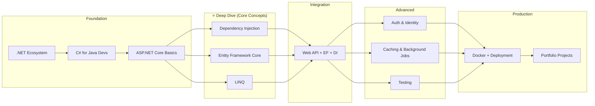

# .NET / ASP.NET Core — Zero-to-Hero Learning Roadmap

> **Target Audience:** You know Java & Node.js but **zero** .NET experience.  
> **Goal:** Production-ready ASP.NET Core developer in ~6–8 weeks (part-time).  
> **Theme:** Learn by analogy (Java → C#, Spring Boot → ASP.NET Core, Hibernate → EF Core).

---

## Prerequisites (You Already Have These)

| Java Concept | .NET Equivalent | Notes |
|---|---|---|
| JVM | CLR (Common Language Runtime) | Same idea: compile to IL, JIT at runtime |
| Maven / Gradle | NuGet + `dotnet restore` | Package managers |
| Spring Boot | ASP.NET Core | Web framework |
| Spring DI Container | Built-in `Microsoft.Extensions.DependencyInjection` | ASP.NET Core has DI baked in — no extra jars |
| Hibernate / JPA | Entity Framework Core | ORM — but EF is more "LINQ-first" |
| Streams API | LINQ | **Much** more powerful in .NET |
| `public static void main` | `Top-level statements` or `Main` | Same entry-point concept |
| `interface` / `class` | Same keywords | C# borrowed from Java |
| `try-catch-finally` | Same | Plus `using` for disposables |

---

## Learning Timeline (6–8 Weeks)

```mermaid
gantt
    title .NET / ASP.NET Core Learning Timeline
    dateFormat  YYYY-MM-DD
    axisFormat  %b %d

    section Foundation
    .NET Ecosystem & C# Basics           :a1, 7d
    section Core Web
    ASP.NET Core Fundamentals            :a2, after a1, 7d
    section Deep Dive ⭐
    Dependency Injection Deep Dive       :a3, after a2, 5d
    Entity Framework Core Deep Dive      :a4, after a3, 7d
    LINQ Deep Dive                       :a5, after a4, 5d
    section Build
    Web APIs + EF Integration            :a6, after a4, 5d
    section Advanced
    Auth / Testing / Caching / Deploy    :a7, after a6, 5d
    section Practice
    Hands-on Projects                    :a8, after a7, 7d
    Interview Prep                       :a9, after a8, 3d
```

---

## Weekly Plan

### Week 1 — .NET Ecosystem & C# for Java Devs
| Day | Topic | Doc |
|-----|-------|-----|
| 1 | .NET vs .NET Core vs .NET Framework — the big picture | [01-dotnet-ecosystem](./01-dotnet-ecosystem.md) |
| 2 | Install SDK, CLI, first "Hello World" | |
| 3 | C# syntax: types, classes, interfaces — **Java parallels** | |
| 4 | **OOP in C# — deep dive** (classes, inheritance, polymorphism, records, structs, pattern matching) | [01a-oop-csharp](./01a-oop-csharp.md) |
| 5 | Properties, events, delegates, records | |
| 6 | Async/await (from Node.js / Java perspective) | |
| 7 | **Mini exercise:** Console app + class library | |

### Week 2 — ASP.NET Core Fundamentals
| Day | Topic | Doc |
|-----|-------|-----|
| 1 | What is ASP.NET Core? Project templates | [02-aspnet-core-basics](./02-aspnet-core-basics.md) |
| 2 | Middleware pipeline — the heart of ASP.NET Core | |
| 3 | Controllers, Routing, Model Binding | |
| 4 | Minimal APIs vs Controller-based APIs | |
| 5 | Configuration (`appsettings.json`, Options pattern) | |
| 6 | Logging (ILogger, Serilog) | |
| 7 | **Mini exercise:** Build a simple REST API | |

### Week 3 — Dependency Injection ⭐ Deep Dive
| Day | Topic | Doc |
|-----|-------|-----|
| 1 | What is DI? Why does .NET bake it in? | [03-dependency-injection](./03-dependency-injection.md) |
| 2 | Service lifetimes: Singleton, Scoped, Transient | |
| 3 | Registering services — 5 different ways | |
| 4 | Advanced: Decorators, Factories, Open Generics | |
| 5 | **Scoped vs Transient bugs** — real-world pitfalls | |
| 6 | Scrutor for assembly scanning | |
| 7 | **Mini exercise:** Refactor a tightly-coupled app to use DI | |

### Week 4 — Entity Framework Core ⭐ Deep Dive
| Day | Topic | Doc |
|-----|-------|-----|
| 1 | What is EF Core? Code-First vs Database-First | [04-entity-framework](./04-entity-framework.md) |
| 2 | DbContext, DbSet, Entity configuration | |
| 3 | Relationships: 1:1, 1:N, N:N | |
| 4 | Migrations — add, remove, apply | |
| 5 | Querying with LINQ (IQueryable vs IEnumerable) | |
| 6 | Eager / Explicit / Lazy Loading — **The N+1 problem** | |
| 7 | **Mini exercise:** Build data layer for Blog/Post/Comment | |

### Week 5 — LINQ ⭐ Deep Dive
| Day | Topic | Doc |
|-----|-------|-----|
| 1 | LINQ syntax: Query vs Method syntax | [05-linq](./05-linq.md) |
| 2 | Select, Where, OrderBy, GroupBy — with 10+ examples | |
| 3 | Join, GroupJoin, SelectMany | |
| 4 | Aggregation (Sum, Count, Min, Max, Aggregate) | |
| 5 | LINQ to Objects vs LINQ to Entities (EF) | |
| 6 | Deferred execution — the biggest gotcha | |
| 7 | **Mini exercise:** Complex LINQ queries | |

### Week 6 — Web APIs + EF Integration
| Day | Topic | Doc |
|-----|-------|-----|
| 1 | Clean Architecture: Controllers → Services → Repositories → EF | [06-web-api-and-data-access](./06-web-api-and-data-access.md) |
| 2 | DTOs, AutoMapper | |
| 3 | CRUD endpoints with EF | |
| 4 | Pagination, filtering, sorting | |
| 5 | Global exception handling, validation (FluentValidation) | |
| 6 | **Mini project:** Complete Product Catalog API | |
| 7 | Code review + polish | |

### Week 7 — Advanced Topics
| Day | Topic | Doc |
|-----|-------|-----|
| 1 | JWT Authentication & Authorization | [07-advanced-and-deployment](./07-advanced-and-deployment.md) |
| 2 | ASP.NET Core Identity | |
| 3 | Caching (IMemoryCache, IDistributedCache, Redis) | |
| 4 | Background jobs (IHostedService, Hangfire) | |
| 5 | Testing (xUnit, Moq, Integration tests) | |
| 6 | Docker + Deployment (IIS / Azure / Linux) | |
| 7 | **Mini project:** Add auth + caching to Catalog API | |

### Week 8 — Projects & Interview Prep
| Day | Topic | Doc |
|-----|-------|-----|
| 1–3 | Build full E-Commerce API (see projects doc) | [08-project-practicals](./08-project-practicals.md) |
| 4–5 | Build a real-time Chat API with SignalR | |
| 6–7 | Interview Q&A | [09-interview-questions](./09-interview-questions.md) |

---

## Learning Path Visualization



---

## How to Use These Docs

1. **Follow the weekly plan** — each day maps to a section in the documents
2. **Code along** — every example is copy-paste ready. Create a new project and type them out.
3. **Run every snippet** — don't just read. `dotnet run` is your friend.
4. **Refer to the "Deep Dive" trio** (DI, EF, LINQ) whenever you're stuck — they're the backbone of real .NET apps.
5. **Use the tracker** below to mark your progress.

---

## Progress Tracker

| Module | Completed? | Date |
|--------|-----------|------|
| 01 — .NET Ecosystem & C# | ⬜ | |
| 01a — OOP in C# (Deep Dive) | ⬜ | |
| 02 — ASP.NET Core Basics | ⬜ | |
| 03 — Dependency Injection ⭐ | ⬜ | |
| 04 — Entity Framework Core ⭐ | ⬜ | |
| 05 — LINQ ⭐ | ⬜ | |
| 06 — Web API + EF Integration | ⬜ | |
| 07 — Advanced Topics | ⬜ | |
| 08 — Practical Projects | ⬜ | |
| 09 — Interview Questions | ⬜ | |

---

> **Pro Tip:** You know Java + Node.js — you already understand OOP, async, DI, and ORMs. The learning curve is **shallow** for you. Focus your energy on the "C#-isms" (LINQ, Properties, Delegates) and the ASP.NET pipeline.
