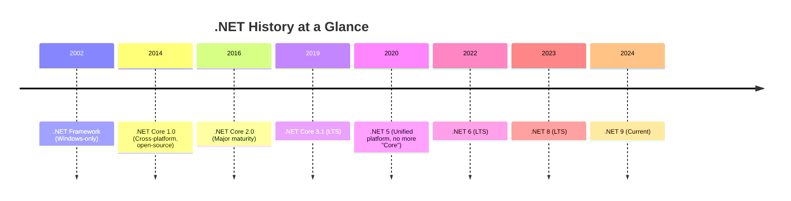

# 01 — .NET Ecosystem & C# for Java Developers

---

## 1. The Big Picture: .NET Flavors



| Flavor | What it is | When to use |
|--------|-----------|-------------|
| **.NET Framework** | Legacy, Windows-only (4.8.x) | Old enterprise apps. Don't start new projects. |
| **.NET Core** | Cross-platform, open-source (3.1) | Historic. Now called just ".NET". |
| **.NET 5/6/7/8/9** | The modern .NET — one platform for all | **Always use this for new projects.** |

> **Your choice:** .NET 8 or .NET 9 (both LTS or current). We'll use **.NET 8** throughout.

---

## 2. Installation

```bash
# 1. Download SDK from https://dotnet.microsoft.com/download
# 2. Verify installation
dotnet --version
# Output: 8.0.xxx

# 3. Your first app
dotnet new console -n HelloDotnet
cd HelloDotnet
dotnet run
```

```csharp
// Program.cs — Top-level statements (no class needed!)
Console.WriteLine("Hello from .NET!");
```

---

## 3. C# for Java Developers — Side-by-Side

### 3.1 Hello World

```java
// Java
public class Hello {
    public static void main(String[] args) {
        System.out.println("Hello");
    }
}
```

```csharp
// C# — top-level statements (C# 10+)
Console.WriteLine("Hello");

// C# — traditional (older style)
class Program {
    static void Main(string[] args) {
        Console.WriteLine("Hello");
    }
}
```

### 3.2 Type System

```java
// Java
int x = 5;
String name = "John";
Integer nullable = null;
```

```csharp
// C#
int x = 5;
string name = "John";
int? nullable = null;  // Nullable<T> — the ? suffix
```

**Key Differences:**
- `string` (lowercase) is an alias for `System.String`
- `int` is `System.Int32`
- `var` keyword for implicit typing (like Java's `var`)

### 3.3 Properties (NO Java equivalent!)

```java
// Java — boilerplate
public class Person {
    private String name;
    private int age;

    public String getName() { return name; }
    public void setName(String name) { this.name = name; }
    public int getAge() { return age; }
    public void setAge(int age) { this.age = age; }
}
```

```csharp
// C# — auto-implemented properties
public class Person {
    public string Name { get; set; }  // Compiler generates backing field
    public int Age { get; set; }

    // Read-only property
    public bool IsAdult => Age >= 18;  // Expression-bodied member
}
```

### 3.4 Records (C# 9+) — Immutable DTOs

```csharp
// Immutable, value-based equality, deconstruction
public record Person(string Name, int Age);

var p1 = new Person("Alice", 30);
var p2 = new Person("Alice", 30);
Console.WriteLine(p1 == p2);  // true (value equality — unlike Java)

// With-expression (immutable update)
var p3 = p1 with { Age = 31 };
```

### 3.5 Null Handling

```csharp
string? maybeNull = null;

// Null-conditional operator (?.)
int? length = maybeNull?.Length;  // null instead of NullPointerException

// Null-coalescing operator (??)
string result = maybeNull ?? "default";

// Null-coalescing assignment (??=)
maybeNull ??= "assigned if null";
```

### 3.6 Async/Await (From Node.js / Java)

```java
// Java (CompletableFuture)
CompletableFuture.supplyAsync(() -> fetchData())
    .thenApply(data -> process(data))
    .thenAccept(result -> System.out.println(result));
```

```csharp
// C# — much cleaner
async Task ProcessAsync() {
    var data = await FetchDataAsync();
    var result = Process(data);
    Console.WriteLine(result);
}
```

### 3.7 Delegates & Events (No Java equivalent)

```csharp
// Delegate = type-safe function pointer
delegate int Operation(int a, int b);

// Lambda → delegate
Operation add = (a, b) => a + b;
Console.WriteLine(add(3, 4));  // 7
```

---

## 4. .NET Project Structure

```
MyApi/
├── Program.cs          # Entry point, service registration, middleware pipeline
├── appsettings.json    # Configuration (like application.yml)
├── appsettings.Development.json
├── Controllers/        # API controllers (like @RestController)
├── Services/           # Business logic
├── Data/               # DbContext, Migrations
├── Models/             # Entity models, DTOs
├── Properties/
│   └── launchSettings.json
└── MyApi.csproj        # Project file (like pom.xml)
```

**The `.csproj` file:**

```xml
<Project Sdk="Microsoft.NET.Sdk.Web">
  <PropertyGroup>
    <TargetFramework>net8.0</TargetFramework>
    <Nullable>enable</Nullable>
    <ImplicitUsings>enable</ImplicitUsings>
  </PropertyGroup>

  <ItemGroup>
    <PackageReference Include="Microsoft.EntityFrameworkCore" Version="8.0.0" />
  </ItemGroup>
</Project>
```

> **NuGet** = Maven Central. Install packages:
> ```bash
> dotnet add package Microsoft.EntityFrameworkCore
> dotnet add package Microsoft.EntityFrameworkCore.SqlServer
> ```

---

## 5. CLI Cheat Sheet

```bash
# Create
dotnet new console             # Console app
dotnet new webapi              # ASP.NET Core Web API
dotnet new classlib            # Class library
dotnet new mvc                 # MVC app
dotnet new sln                 # Solution file

# Build & Run
dotnet build                   # Compile
dotnet run                     # Build + Run
dotnet watch run               # Hot reload (like nodemon)

# Test
dotnet new xunit               # Test project
dotnet test                    # Run tests

# Packages
dotnet add package <name>
dotnet remove package <name>
dotnet list package

# EF Core (dotnet-ef tool)
dotnet tool install --global dotnet-ef
dotnet ef migrations add InitialCreate
dotnet ef database update
```

---

## 6. Your First .NET App — Step by Step

```bash
# Step 1: Create a Web API project
dotnet new webapi -n MyFirstApi
cd MyFirstApi

# Step 2: Run it
dotnet run
# Output: Now listening on: https://localhost:5001
```

You'll see this `Program.cs`:

```csharp
var builder = WebApplication.CreateBuilder(args);

// Add services to DI container
builder.Services.AddControllers();
builder.Services.AddEndpointsApiExplorer();
builder.Services.AddSwaggerGen();

var app = builder.Build();

// Configure middleware pipeline
if (app.Environment.IsDevelopment()) {
    app.UseSwagger();
    app.UseSwaggerUI();
}

app.UseHttpsRedirection();
app.UseAuthorization();
app.MapControllers();

app.Run();
```

And a sample controller:

```csharp
[ApiController]
[Route("api/[controller]")]
public class WeatherForecastController : ControllerBase {

    [HttpGet]
    public IEnumerable<WeatherForecast> Get() {
        // ...
    }
}
```

> **🎯 Exercise:** Create the project, run it, open `/swagger` in your browser. You now have a working API!

---

## 7. Quick Reference: Java → C# Map

| Java | C# |
|------|-----|
| `class` | `class` |
| `interface` | `interface` |
| `abstract class` | `abstract class` |
| `extends` | `:` |
| `implements` | `:` |
| `@Override` | `override` |
| `final` | `sealed` / `readonly` |
| `static` | `static` |
| `void` | `void` |
| `String` | `string` |
| `Integer` | `int` |
| `List<String>` | `List<string>` |
| `Map<K,V>` | `Dictionary<K,V>` |
| `Optional<T>` | `T?` / `Nullable<T>` |
| `Stream<T>` | `IEnumerable<T>` |
| `@Autowired` | Constructor Injection |
| `@RestController` | `[ApiController]` |
| `@GetMapping` | `[HttpGet]` |
| `@RequestMapping` | `[Route]` |
| `try-with-resources` | `using` |
| `synchronized` | `lock` |
| `System.out.println` | `Console.WriteLine` |

---

> **Remember:** You already understand 70% of C# because you know Java. Focus on what's **new**: Properties, LINQ, Delegates, Records, and the `?` / `??` / `?.` operators.
