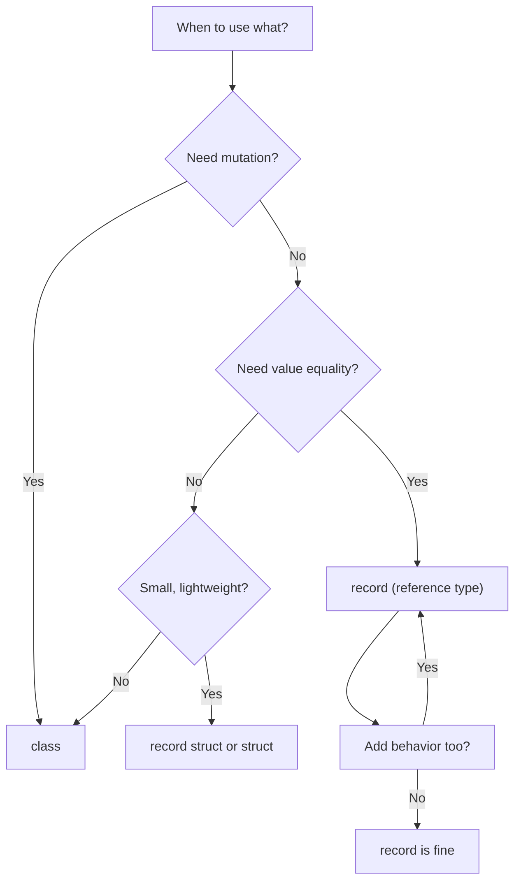
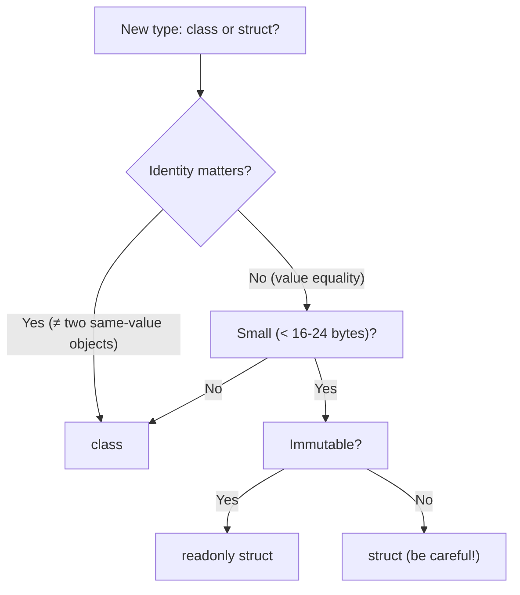

# 01a — Object-Oriented Programming in C# (Deep Dive)

> **Prerequisite:** You know Java OOP — this doc covers **what's the same** and **what's different** in C#.
>
> **C# 14 (.NET 10):** New features include the `field` keyword for auto-property access and `extension` members (extension everything).

---

## 1. C# OOP at a Glance vs Java

| Concept | Java | C# |
|---------|------|-----|
| Base class | `Object` | `object` / `System.Object` |
| Inheritance | `extends` | `:` |
| Interface | `implements` | `:` |
| Method override | `@Override` | `override` keyword |
| Prevent override | `final` | `sealed` |
| Prevent inheritance | `final class` | `sealed class` |
| Must override | `abstract` | `abstract` |
| Constructor chaining | `super()` | `base()` |
| Access modifiers | `public`, `protected`, `default`, `private` | `public`, `protected`, `internal`, `private`, `protected internal`, `private protected` |
| Type checking | `instanceof` | `is` |
| Type casting | `(Type) obj` | `(Type)obj` or `as Type` |

> **New in C# (no Java equivalent):** Records, Properties, Extension methods, Partial classes, `init` setters, `record struct`, default interface methods, `required` modifier.

---

## 2. Classes — The Basics

```csharp
// Access modifiers: public, private, protected, internal
public class Person {
    // Fields (private by convention)
    private string _name;
    private int _age;

    // Constructor
    public Person(string name, int age) {
        _name = name;
        _age = age;
    }

    // Methods
    public void Introduce() {
        Console.WriteLine($"Hi, I'm {_name} and I'm {_age} years old.");
    }

    // Property (C#-specific — replaces getter/setter methods)
    public string Name {
        get => _name;
        set => _name = value;
    }

    // Expression-bodied member (shorthand)
    public bool IsAdult => _age >= 18;
}
```

---

## 3. Properties — The C# Way

Properties replace the Java pattern of `getX()` / `setX()` methods.

### 3.1 Auto-Implemented Properties (Most Common)

```java
// Java
public class Person {
    private String name;
    public String getName() { return name; }
    public void setName(String name) { this.name = name; }
}
```

```csharp
// C# — 1 line instead of 13
public class Person {
    public string Name { get; set; }
    public int Age { get; set; }
}

// Usage — natural field syntax
var p = new Person();
p.Name = "Alice";        // Calls the setter
Console.WriteLine(p.Name); // Calls the getter
```

### 3.2 Property Access Levels

```csharp
public class Product {
    // Public get, private set (immutable outside class)
    public string Name { get; private set; }

    // Read-only — only set in constructor or via init
    public int Id { get; }

    // Computed property (no backing field)
    public decimal PriceWithTax => Price * 1.1m;

    // Full property with backing field + logic
    private decimal _price;
    public decimal Price {
        get => _price;
        set {
            if (value < 0)
                throw new ArgumentException("Price cannot be negative");
            _price = value;
        }
    }
}
```

### 3.3 Init-Only Properties (C# 9+)

```csharp
// Can only be set during object initialization (constructor OR object initializer)
public class Product {
    public int Id { get; init; }
    public string Name { get; init; }
}

// Set during creation
var p = new Product { Id = 1, Name = "Laptop" };

// ⛔ ERROR — can't change after creation
p.Name = "Tablet";  // Compile error!
```

### 3.4 Required Properties (C# 11+)

```csharp
public class Product {
    public required int Id { get; init; }
    public required string Name { get; init; }
    public decimal Price { get; init; }  // Optional
}

// ⛔ ERROR — must set required properties
var p = new Product { Id = 1 };  // CS9035: Required property 'Name' must be set

// ✅ CORRECT
var p = new Product { Id = 1, Name = "Laptop" };
```

---

## 4. Inheritance

```csharp
// Base class
public class Animal {
    public string Name { get; set; }

    public Animal(string name) {
        Name = name;
    }

    // virtual = can be overridden (like Java's non-final method)
    public virtual void MakeSound() {
        Console.WriteLine("Some generic animal sound");
    }
}

// Derived class — single inheritance only (same as Java)
public class Dog : Animal {
    public string Breed { get; set; }

    // base() = super() in Java
    public Dog(string name, string breed) : base(name) {
        Breed = breed;
    }

    // override = @Override in Java
    public override void MakeSound() {
        Console.WriteLine("Woof!");
    }
}
```

### 4.1 Sealed Methods & Classes

```csharp
public sealed class FinalClass {
    // Cannot be inherited from — like Java's final class
}

public class Base {
    public virtual void Method() { }

    public virtual void AnotherMethod() { }
}

public class Derived : Base {
    public override sealed void Method() {
        // sealed override = cannot be overridden further
    }
}

public class MoreDerived : Derived {
    // ⛔ ERROR: cannot override 'Method' because it's sealed
    // public override void Method() { }
}
```

---

## 5. Abstract Classes vs Interfaces

### 5.1 Abstract Classes

```csharp
public abstract class Shape {
    public string Color { get; set; }

    // Abstract method — must override
    public abstract double GetArea();

    // Concrete method
    public void Display() {
        Console.WriteLine($"Area: {GetArea()}");
    }
}

public class Circle : Shape {
    public double Radius { get; set; }

    public override double GetArea() => Math.PI * Radius * Radius;
}
```

### 5.2 Interfaces — What's Different from Java

```csharp
// Traditional interface (like Java)
public interface IRepository<T> {
    Task<T?> GetByIdAsync(int id);
    Task<List<T>> GetAllAsync();
    Task<T> CreateAsync(T entity);
}

// Implementation
public class ProductRepository : IRepository<Product> {
    public async Task<Product?> GetByIdAsync(int id) { /* ... */ }
    public async Task<List<Product>> GetAllAsync() { /* ... */ }
    public async Task<Product> CreateAsync(Product entity) { /* ... */ }
}
```

**Naming convention:** Interfaces start with `I` — this is universal in .NET.

### 5.3 Default Interface Methods (C# 8+) — No Java Equivalent Until Java 9

```csharp
public interface ILogger {
    void Log(string message);

    // Default implementation — implementing classes can override or use default
    void LogError(string message) {
        Log($"[ERROR] {message}");
    }
}

public class ConsoleLogger : ILogger {
    public void Log(string message) {
        Console.WriteLine(message);
    }
    // LogError is inherited — no need to implement
}

public class FancyLogger : ILogger {
    public void Log(string message) {
        Console.WriteLine($"*** {message} ***");
    }

    // Override default
    public void LogError(string message) {
        Log($"!!! {message} !!!");
    }
}
```

### 5.4 Explicit Interface Implementation

```csharp
public interface IReader {
    string Read();
}

public interface IWriter {
    void Write(string data);
}

public class FileHandler : IReader, IWriter {
    // Explicit implementation — only accessible through the interface
    string IReader.Read() {
        return "reading from file...";
    }

    void IWriter.Write(string data) {
        Console.WriteLine($"writing: {data}");
    }

    // Public method
    public void Close() {
        Console.WriteLine("closing file...");
    }
}

// Usage
var handler = new FileHandler();
handler.Close();                    // OK

// Must cast to interface
((IReader)handler).Read();          // OK
IWriter writer = handler;
writer.Write("data");               // OK

// handler.Read();                  // ⛔ ERROR — not public
```

---

## 6. Polymorphism — Method Overloading & Overriding

```csharp
public class Calculator {
    // Overloading — same method name, different parameters
    public int Add(int a, int b) => a + b;
    public double Add(double a, double b) => a + b;
    public int Add(int a, int b, int c) => a + b + c;

    // params — variable number of arguments (like varargs in Java)
    public int Sum(params int[] numbers) => numbers.Sum();
}

// Polymorphism via virtual/override
public class Notification {
    public virtual void Send(string message) {
        Console.WriteLine($"Sending: {message}");
    }
}

public class EmailNotification : Notification {
    public override void Send(string message) {
        Console.WriteLine($"Email: {message}");
    }
}

public class SmsNotification : Notification {
    public override void Send(string message) {
        Console.WriteLine($"SMS: {message}");
    }
}

// Polymorphic behavior
Notification notif = new EmailNotification();
notif.Send("Hello");  // Calls EmailNotification.Send()

List<Notification> notifications = new() {
    new EmailNotification(),
    new SmsNotification()
};

foreach (var n in notifications) {
    n.Send("Test");  // Each calls its own implementation
}
```

---

## 7. Records — Immutable Data Objects

Records are C#'s answer to creating simple, immutable, value-based data objects.

```csharp
// record — reference type, immutable, value equality
public record Person(string Name, int Age);

// Equivalent to writing all this manually:
public class Person : IEquatable<Person> {
    public string Name { get; init; }
    public int Age { get; init; }

    public Person(string name, int age) {
        Name = name;
        Age = age;
    }

    // Value equality, ToString, Deconstruct, GetHashCode — all auto-generated
}

// Usage
var p1 = new Person("Alice", 30);
var p2 = new Person("Alice", 30);

Console.WriteLine(p1 == p2);  // true (value equality) — NOT true for class!
Console.WriteLine(p1);         // Person { Name = Alice, Age = 30 }

// Non-destructive mutation
var p3 = p1 with { Age = 31 };  // New object with Age changed
Console.WriteLine(p3);           // Person { Name = Alice, Age = 31 }

// Record with custom members
public record Product(int Id, string Name, decimal Price) {
    public decimal Tax => Price * 0.1m;  // Computed property
}

// record struct — value type record (C# 10+)
public record struct Point(int X, int Y);

// Positional vs nominal records
public record Employee {        // Nominal — must define properties manually
    public required int Id { get; init; }
    public required string Name { get; init; }
}
```



---

## 8. Structs — Value Types

```csharp
// struct — value type (stack allocated when local)
public struct Point {
    public int X { get; set; }
    public int Y { get; set; }

    public Point(int x, int y) {
        X = x;
        Y = y;
    }

    public double DistanceTo(Point other) {
        var dx = X - other.X;
        var dy = Y - other.Y;
        return Math.Sqrt(dx * dx + dy * dy);
    }
}

// Usage — value semantics
var p1 = new Point(3, 4);
var p2 = p1;           // COPY — p2 is a completely separate object
p2.X = 10;

Console.WriteLine(p1.X);  // 3 — NOT affected by p2 change!

// ✅ Use struct when:
// - Represents a single value (like Point, Color, DateTime)
// - Instance is small (< 16 bytes)
// - Immutable (recommended — use readonly struct)
// - Short-lived / frequently created

// ❌ Don't use struct when:
// - Needs inheritance (structs can't inherit)
// - Large (> 16-24 bytes — passing by value is expensive)
// - Needs to be null (unless Nullable<T>)
// - Mutable (mutable structs cause subtle bugs)

// readonly struct — guarantees immutability
public readonly struct Measurement {
    public double Value { get; }
    public string Unit { get; }

    public Measurement(double value, string unit) {
        Value = value;
        Unit = unit;
    }
}
```

### Class vs Struct — When to Use



---

## 9. Static Classes & Members

```csharp
// Static class — cannot be instantiated, cannot inherit
public static class MathUtils {
    public static readonly double Pi = 3.14159;

    public static double CircleArea(double radius) => Pi * radius * radius;

    // Static constructor — runs once before any member is accessed
    static MathUtils() {
        Console.WriteLine("MathUtils initialized");
    }
}

// Usage — no new keyword
double area = MathUtils.CircleArea(5);

// Static members on non-static classes
public class Counter {
    public static int InstanceCount { get; private set; }

    public Counter() {
        InstanceCount++;
    }
}

var c1 = new Counter();
var c2 = new Counter();
Console.WriteLine(Counter.InstanceCount);  // 2
```

---

## 10. Pattern Matching — Java's `switch` on Steroids

```csharp
public static string Describe(object obj) => obj switch {
    int i when i < 0 => $"Negative integer: {i}",
    int i => $"Positive integer: {i}",
    string s => $"String of length {s.Length}: '{s}'",
    null => "Null value",
    _ => $"Unknown type: {obj.GetType().Name}"  // default case
};

// Property pattern
public static string GetAreaDescription(Shape shape) => shape switch {
    Circle { Radius: > 0 } c => $"Circle with radius {c.Radius}",
    Rectangle { Width: > 0, Height: > 0 } r => $"Rectangle {r.Width}x{r.Height}",
    _ => "Unknown shape"
};

// Tuple pattern
public static string Classify(int age, bool isStudent) => (age, isStudent) switch {
    (< 18, _) => "Minor",
    (_, true) => "Student",
    (>= 65, _) => "Senior",
    _ => "Adult"
};

// List pattern (C# 11+)
public static string CheckSequence(int[] numbers) => numbers switch {
    [] => "Empty",
    [1] => "Just one",
    [1, 2] => "One then two",
    [1, 2, .. var rest] => $"Starts with 1,2 and has {rest.Length} more",
    _ => "Other"
};
```

---

## 11. Extension Methods

Add methods to existing types **without modifying them**. Used heavily by LINQ.

```csharp
public static class StringExtensions {
    // "this" keyword marks the first param as the type being extended
    public static bool IsNullOrWhiteSpace(this string? str) {
        return string.IsNullOrWhiteSpace(str);
    }

    public static string Truncate(this string str, int maxLength) {
        return str.Length <= maxLength ? str : str[..maxLength] + "...";
    }

    public static T Random<T>(this IEnumerable<T> source) {
        var list = source.ToList();
        return list[System.Random.Shared.Next(list.Count)];
    }
}

// Usage — looks like instance methods!
string text = "Hello World";
Console.WriteLine(text.IsNullOrWhiteSpace());  // false
Console.WriteLine(text.Truncate(5));            // "Hello..."
Console.WriteLine(new[] { 1, 2, 3 }.Random());  // 1, 2, or 3
```

**Extension methods are resolved at compile time — they can't be "overridden".**

---

## 12. Partial Classes

Split a class across multiple files — useful for code generation.

```csharp
// File 1: Person.cs
public partial class Person {
    public string FirstName { get; set; }
    public string LastName { get; set; }
}

// File 2: Person.Partial.cs
public partial class Person {
    public string FullName => $"{FirstName} {LastName}";

    public void Introduce() {
        Console.WriteLine($"Hi, I'm {FullName}");
    }
}

// All parts are combined at compile time into one class
```

---

## 13. Nested Classes

```csharp
public class Order {
    public int Id { get; set; }
    public List<OrderItem> Items { get; set; } = new();

    // Nested class — logically grouped with Order
    public class OrderItem {
        public int ProductId { get; set; }
        public int Quantity { get; set; }
        public decimal Price { get; set; }
    }
}

// Usage
var item = new Order.OrderItem { ProductId = 1, Quantity = 2, Price = 10 };
```

---

## 14. Object & Collection Initializers

```csharp
// Object initializer — set properties without calling a constructor with params
var person = new Person {
    Name = "Alice",
    Age = 30
};

// Collection initializer
var numbers = new List<int> { 1, 2, 3, 4, 5 };

// Dictionary initializer
var config = new Dictionary<string, string> {
    ["host"] = "localhost",
    ["port"] = "8080"
};

// Nested initializers
var order = new Order {
    Id = 1,
    Items = {
        new Order.OrderItem { ProductId = 1, Quantity = 2, Price = 50 },
        new Order.OrderItem { ProductId = 2, Quantity = 1, Price = 100 }
    }
};
```

---

## 15. The `is`, `as`, and Casting Operators

```csharp
object obj = "Hello World";

// is — type checking (like instanceof)
if (obj is string) {
    Console.WriteLine("It's a string!");
}

// is + pattern — declare variable inline
if (obj is string text) {
    Console.WriteLine(text.Length);  // text is available here
}

// as — safe cast (returns null on failure, NOT exception)
string? str = obj as string;  // OK — str = "Hello World"
int? num = obj as int?;      // num = null (no exception)

// Traditional cast — throws if fails
string definitely = (string)obj;  // Throws if obj is not string
```

---

## 16. Encapsulation — Access Modifiers

```csharp
public class Example {
    // ✅ Public — accessible from anywhere
    public string PublicField;

    // ✅ Private — only within this class (DEFAULT for class members)
    private string PrivateField;

    // ✅ Protected — this class + derived classes
    protected string ProtectedField;

    // ✅ Internal — same assembly (project) only
    internal string InternalField;

    // ✅ Protected Internal — same assembly OR derived classes
    protected internal string ProtectedInternalField;

    // ✅ Private Protected — same class OR derived classes in same assembly (C# 7.2+)
    private protected string PrivateProtectedField;
}

// Assembly = project / .dll
// File-scoped namespace (shorthand for namespace X { ... })
```

**Best practice:** Start with `private`, increase visibility only when needed.

---

## 17. Common OOP Patterns in C#

### 17.1 Builder Pattern (with Records)

```csharp
public class ProductBuilder {
    private int _id;
    private string _name = string.Empty;
    private decimal _price;

    public ProductBuilder WithId(int id) { _id = id; return this; }
    public ProductBuilder WithName(string name) { _name = name; return this; }
    public ProductBuilder WithPrice(decimal price) { _price = price; return this; }

    public Product Build() => new() { Id = _id, Name = _name, Price = _price };
}

// Usage
var product = new ProductBuilder()
    .WithId(1)
    .WithName("Laptop")
    .WithPrice(999.99m)
    .Build();
```

### 17.2 Factory Pattern

```csharp
public interface INotificationService {
    Task SendAsync(string to, string message);
}

public class EmailService : INotificationService { /* ... */ }
public class SmsService : INotificationService { /* ... */ }

public static class NotificationFactory {
    public static INotificationService Create(string type) => type switch {
        "email" => new EmailService(),
        "sms" => new SmsService(),
        _ => throw new ArgumentException($"Unknown type: {type}")
    };
}
```

### 17.3 Strategy Pattern (with DI)

```csharp
// In DI container — automatically resolves strategy
builder.Services.AddScoped<IPaymentStrategy, CreditCardStrategy>();
builder.Services.AddScoped<IPaymentStrategy, PayPalStrategy>();
builder.Services.AddScoped<IPaymentStrategy, CryptoStrategy>();

public class PaymentService {
    private readonly IEnumerable<IPaymentStrategy> _strategies;

    public PaymentService(IEnumerable<IPaymentStrategy> strategies) {
        _strategies = strategies;
    }

    public Task ProcessAsync(string method, decimal amount) {
        var strategy = _strategies.FirstOrDefault(s => s.Method == method)
            ?? throw new NotSupportedException($"Payment method '{method}' not supported");
        return strategy.PayAsync(amount);
    }
}
```

---

## 18. Quick Reference: Java OOP → C# OOP

| Java | C# |
|------|-----|
| `extends` | `:` |
| `implements` | `:` (separated by comma) |
| `@Override` | `override` |
| `super()` | `base()` |
| `final` method | `sealed` override |
| `final` class | `sealed` class |
| `abstract` | `abstract` |
| `interface` | `interface` |
| `default` method in interface | Supported (C# 8+) |
| `private` method in interface | Supported (C# 8+) |
| `instanceof` | `is` |
| `(Type) obj` | `(Type)obj` or `obj as Type` |
| Getter/setter methods | Properties (`{ get; set; }`) |
| `record` (Java 14+) | `record` (C# 9+) — similar |
| `static` | `static` |
| `this` | `this` |
| `new ClassName()` | `new()` |
| Method references `::` | Lambda `=>` |
| `enum` | `enum` (more powerful in C#) |
| `Optional<T>` | Nullable `?` / Null-coalescing `??` |
| `List<T>` | `List<T>` (same) |
| `Map<K,V>` | `Dictionary<K,V>` |
| varargs `...` | `params` |
| `synchronized` | `lock` |

---

## 19. 🎯 OOP Exercises

### Exercise 1: Design a Library System

```csharp
// Requirements:
// - Book (Title, Author, ISBN, IsBorrowed)
// - Member (Name, MemberId, BorrowedBooks)
// - Librarian : Member (can add/remove books)
// - ILibrary interface (BorrowBook, ReturnBook, GetAvailableBooks)
// - Implement Library class that uses DI for IBookRepository
//
// Key OOP concepts: Inheritance, interfaces, encapsulation, polymorphism
```

### Exercise 2: Refactor to Use Records

```csharp
// Given this class:
public class Product {
    public int Id { get; set; }
    public string Name { get; set; }
    public decimal Price { get; set; }
    public string Category { get; set; }
}

// Convert it to a record. Then:
// 1. Create two products with same values — show == works
// 2. Use with-expression to change price
// 3. Add a computed property for Tax
```

### Exercise 3: Implement the Strategy Pattern

```csharp
// Create an IDiscountStrategy interface with CalculateDiscount(decimal total) method
// Implement: PercentageDiscount(10%), FixedDiscount(50), BuyOneGetOneFree
// Create a CheckoutService that uses IEnumerable<IDiscountStrategy> via DI
// Test with different combinations
```

---

> **Key Insight:** C# OOP is 90% the same as Java OOP. The 10% that's different (Properties, Records, Extension Methods, Pattern Matching) is what makes C# **more productive**. Focus your learning there.
