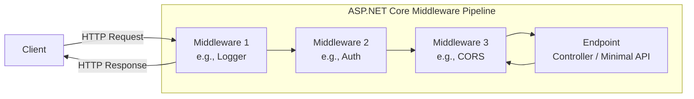

# 02 — ASP.NET Core Fundamentals

---

## 1. What is ASP.NET Core?

ASP.NET Core is a **cross-platform, high-performance** web framework for building:
- Web APIs (REST, JSON)
- MVC web apps (server-rendered HTML)
- Real-time apps (SignalR)
- gRPC services
- Blazor (client + server-side WASM)

> **Java analogy:** ASP.NET Core = Spring Boot + Spring MVC + Spring DI — all **built-in**, no extra dependencies.

---

## 2. The HTTP Request Pipeline



**Key insight:** Every request flows **through** a chain of middleware components, then **back out**. Each middleware can:
1. Do something before the next middleware
2. Pass to the next middleware (`await next()`)
3. Short-circuit (return response early)

---

## 3. Middleware — Deep Dive

```csharp
var app = builder.Build();

// Custom middleware inline
app.Use(async (context, next) => {
    Console.WriteLine($"Request: {context.Request.Path}");

    // Before next middleware
    await next();

    // After next middleware
    Console.WriteLine($"Response: {context.Response.StatusCode}");
});

// Built-in middleware
app.UseHttpsRedirection();    // HTTP → HTTPS redirect
app.UseStaticFiles();         // Serve wwwroot files
app.UseRouting();             // Route matching
app.UseAuthentication();      // Who are you?
app.UseAuthorization();       // Are you allowed?
app.UseCors();                // Cross-Origin Resource Sharing
app.MapControllers();         // Map to controllers
```

### 3.1 Writing Custom Middleware

```csharp
// Middleware class
public class RequestTimingMiddleware {
    private readonly RequestDelegate _next;
    private readonly ILogger<RequestTimingMiddleware> _logger;

    public RequestTimingMiddleware(RequestDelegate next, ILogger<RequestTimingMiddleware> logger) {
        _next = next;
        _logger = logger;
    }

    public async Task InvokeAsync(HttpContext context) {
        var stopwatch = Stopwatch.StartNew();

        await _next(context);

        stopwatch.Stop();
        _logger.LogInformation(
            "{Method} {Path} took {Elapsed}ms",
            context.Request.Method,
            context.Request.Path,
            stopwatch.ElapsedMilliseconds);
    }
}

// Extension method for clean registration
public static class RequestTimingMiddlewareExtensions {
    public static IApplicationBuilder UseRequestTiming(this IApplicationBuilder builder) {
        return builder.UseMiddleware<RequestTimingMiddleware>();
    }
}

// In Program.cs:
app.UseRequestTiming();
```

---

## 4. Controllers (Like `@RestController`)

```csharp
[ApiController]                    // Enables automatic model validation, etc.
[Route("api/[controller]")]       // /api/products
public class ProductsController : ControllerBase {

    private readonly IProductService _productService;

    // Constructor injection (like @Autowired)
    public ProductsController(IProductService productService) {
        _productService = productService;
    }

    // GET /api/products
    [HttpGet]
    public async Task<ActionResult<List<ProductDto>>> GetAll() {
        var products = await _productService.GetAllAsync();
        return Ok(products);  // 200 OK
    }

    // GET /api/products/5
    [HttpGet("{id:int}")]
    public async Task<ActionResult<ProductDto>> GetById(int id) {
        var product = await _productService.GetByIdAsync(id);
        if (product == null) return NotFound();  // 404
        return Ok(product);
    }

    // POST /api/products
    [HttpPost]
    public async Task<ActionResult<ProductDto>> Create(CreateProductDto dto) {
        var product = await _productService.CreateAsync(dto);
        return CreatedAtAction(nameof(GetById), new { id = product.Id }, product);  // 201
    }

    // PUT /api/products/5
    [HttpPut("{id:int}")]
    public async Task<IActionResult> Update(int id, UpdateProductDto dto) {
        await _productService.UpdateAsync(id, dto);
        return NoContent();  // 204
    }

    // DELETE /api/products/5
    [HttpDelete("{id:int}")]
    public async Task<IActionResult> Delete(int id) {
        await _productService.DeleteAsync(id);
        return NoContent();  // 204
    }
}
```

### 4.1 Model Binding — How Parameters Are Injected

```csharp
// From route: /api/products/5
[HttpGet("{id}")]
public IActionResult Get(int id)  // id = 5

// From query: /api/products?page=1&size=10
[HttpGet]
public IActionResult GetAll([FromQuery] int page = 1, [FromQuery] int size = 10)

// From body (POST/PUT): JSON body
[HttpPost]
public IActionResult Create([FromBody] CreateProductDto dto)

// From header
[HttpGet]
public IActionResult Get([FromHeader] string authorization)

// From form data
[HttpPost]
public IActionResult Upload([FromForm] IFormFile file)

// Combined
[HttpPut("{id}")]
public IActionResult Update(int id, [FromBody] UpdateProductDto dto)
```

### 4.2 Return Types

```csharp
// Specific type (implicit 200)
[HttpGet]
public IEnumerable<Product> GetAll() => products;

// IActionResult (flexible status codes)
[HttpGet("{id}")]
public IActionResult Get(int id) {
    var product = Find(id);
    if (product == null) return NotFound();
    return Ok(product);
}

// ActionResult<T> (best — combines both)
[HttpGet("{id}")]
public ActionResult<Product> Get(int id) {
    var product = Find(id);
    if (product == null) return NotFound();
    return product;  // implicit Ok()
}
```

---

## 5. Minimal APIs (Alternative to Controllers)

> **When to use:** Simple APIs, microservices, small endpoints. Controllers for larger projects.

```csharp
var app = builder.Build();

// GET /products
app.MapGet("/products", async (IProductService svc) => {
    return await svc.GetAllAsync();
});

// GET /products/5
app.MapGet("/products/{id:int}", async (int id, IProductService svc) => {
    var product = await svc.GetByIdAsync(id);
    return product is null ? Results.NotFound() : Results.Ok(product);
});

// POST /products
app.MapPost("/products", async (CreateProductDto dto, IProductService svc) => {
    var product = await svc.CreateAsync(dto);
    return Results.Created($"/products/{product.Id}", product);
});

app.Run();
```

---

## 6. Configuration (Like `application.yml`)

```json
// appsettings.json
{
  "ConnectionStrings": {
    "DefaultConnection": "Server=.;Database=MyDb;Trusted_Connection=True"
  },
  "JwtSettings": {
    "Secret": "super-secret-key",
    "ExpiryHours": 24
  },
  "Logging": {
    "LogLevel": {
      "Default": "Information"
    }
  }
}
```

```csharp
// Read individual values
var connStr = builder.Configuration.GetConnectionString("DefaultConnection");
var secret = builder.Configuration["JwtSettings:Secret"];

// Strongly-typed — Options pattern (BEST)
public class JwtSettings {
    public string Secret { get; set; }
    public int ExpiryHours { get; set; }
}

// Register in DI
builder.Services.Configure<JwtSettings>(builder.Configuration.GetSection("JwtSettings"));

// Use everywhere via DI
public class AuthService {
    private readonly JwtSettings _settings;
    public AuthService(IOptions<JwtSettings> options) {
        _settings = options.Value;  // .Value to access the config
    }
}
```

---

## 7. Logging (Like SLF4J)

```csharp
public class ProductsController : ControllerBase {
    private readonly ILogger<ProductsController> _logger;

    public ProductsController(ILogger<ProductsController> logger) {
        _logger = logger;
    }

    [HttpGet]
    public IActionResult Get() {
        _logger.LogInformation("Getting all products at {Time}", DateTime.UtcNow);

        try {
            // ...
        } catch (Exception ex) {
            _logger.LogError(ex, "Failed to get products");
            return StatusCode(500);
        }
    }
}
```

**Log levels:** `Trace`, `Debug`, `Information`, `Warning`, `Error`, `Critical`

**Add Serilog for structured logging:**
```bash
dotnet add package Serilog.AspNetCore
```

---

## 8. Full Project — Minimal API Example

```csharp
// Program.cs — Everything in one file
using Microsoft.EntityFrameworkCore;

var builder = WebApplication.CreateBuilder(args);

// Services
builder.Services.AddDbContext<AppDbContext>(opts =>
    opts.UseInMemoryDatabase("Items"));
builder.Services.AddEndpointsApiExplorer();
builder.Services.AddSwaggerGen();

var app = builder.Build();

if (app.Environment.IsDevelopment()) {
    app.UseSwagger();
    app.UseSwaggerUI();
}

// In-memory "database"
var items = new List<Item> {
    new() { Id = 1, Name = "Learn .NET", IsComplete = false }
};

// Endpoints
app.MapGet("/items", () => items);

app.MapGet("/items/{id:int}", (int id) => {
    var item = items.FirstOrDefault(i => i.Id == id);
    return item is null ? Results.NotFound() : Results.Ok(item);
});

app.MapPost("/items", (Item item) => {
    item.Id = items.Max(i => i.Id) + 1;
    items.Add(item);
    return Results.Created($"/items/{item.Id}", item);
});

app.Run();

// Record (immutable DTO)
public record Item {
    public int Id { get; init; }
    public string Name { get; init; }
    public bool IsComplete { get; init; }
}
```

---

## 9. Key Takeaways

| Concept | What to Remember |
|---------|-----------------|
| **Middleware** | Everything is middleware. Order matters. `app.Use()` before `app.Map()`. |
| **Controllers** | `[ApiController]`, `[Route]`, `[HttpGet]`, constructor DI |
| **Model Binding** | `[FromBody]`, `[FromQuery]`, `[FromRoute]`, `[FromHeader]` |
| **ActionResult** | `ActionResult<T>` for typed + flexible status codes |
| **Minimal APIs** | Simpler than controllers — great for small/micro services |
| **Configuration** | `IOptions<T>` for strongly-typed config |
| **Logging** | `ILogger<T>` — always inject, never `Console.WriteLine` |

---

## 10. 🎯 Exercise

```bash
# Create a new Web API
dotnet new webapi -n TodoApi
cd TodoApi

# Add the in-memory DB provider
dotnet add package Microsoft.EntityFrameworkCore.InMemory

# Replace Program.cs with the example above
# Run it
dotnet run
# Test at /swagger
```

**Bonus:** Add a PUT endpoint to toggle `IsComplete` status.
