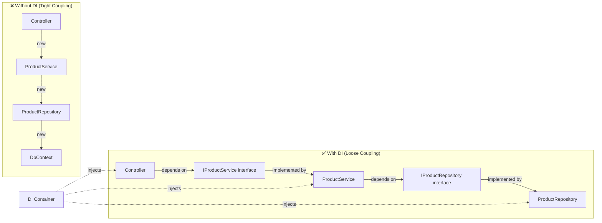
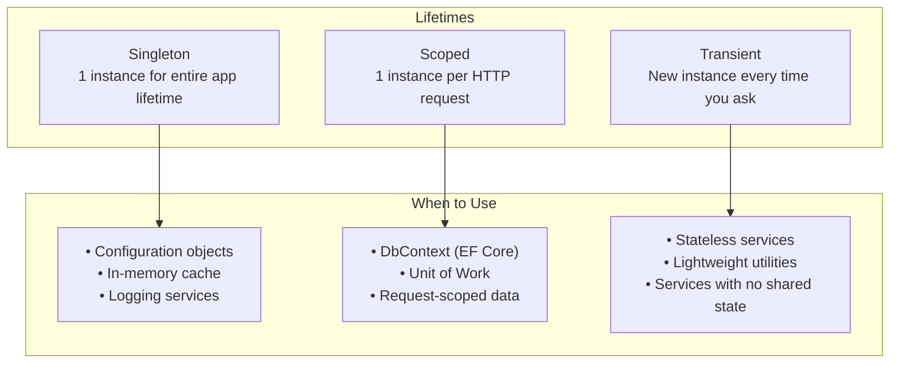

# 03 — Dependency Injection in .NET ⭐ Deep Dive

> **Prerequisite knowledge:** You understand DI from Spring Boot. This doc covers the **.NET-way** — what's the same, what's different, and the advanced patterns you'll use daily.

---

## 1. What is Dependency Injection?



**The core idea:** Classes **declare** what they need (via constructor), and a **container** provides it. No `new` keywords everywhere.

---

## 2. .NET's Built-in DI Container

Unlike Spring where DI is a framework add-on, **ASP.NET Core's DI container is baked into the core**. It's in `Microsoft.Extensions.DependencyInjection`.

```csharp
var builder = WebApplication.CreateBuilder(args);

// The DI container lives here:
builder.Services.AddScoped<IProductService, ProductService>();
builder.Services.AddSingleton<ICacheService, MemoryCacheService>();
builder.Services.AddTransient<IEmailService, SmtpEmailService>();

var app = builder.Build();
// container is frozen — can't register after Build()
```

---

## 3. The Three Service Lifetimes



### 3.1 Singleton

```csharp
// Registration
builder.Services.AddSingleton<ICacheService, InMemoryCacheService>();

// Behavior — ONE instance for the whole app lifetime
var s1 = app.Services.GetService<ICacheService>();
var s2 = app.Services.GetService<ICacheService>();
Console.WriteLine(ReferenceEquals(s1, s2));  // true
```

### 3.2 Scoped (Most common for web apps)

```csharp
// Registration
builder.Services.AddScoped<IOrderService, OrderService>();

// Behavior — ONE instance per HTTP request
// Within the same request, you always get the same instance
// Different requests get DIFFERENT instances

// In a controller:
public class OrdersController : ControllerBase {
    private readonly IOrderService _service;
    private readonly ILogger<OrdersController> _logger;

    // Both get the SAME instance within this request
    public OrdersController(IOrderService service, ILogger<OrdersController> logger) {
        _service = service;
        _logger = logger;
    }
}
```

### 3.3 Transient

```csharp
// Registration
builder.Services.AddTransient<IEmailService, SmtpEmailService>();

// Behavior — NEW instance every time it's injected
// Even within the same request, every injection = a new object
```

### 3.4 The Critical Bug: Captive Dependency

```csharp
// ❌ WRONG: Singleton depending on Scoped = CAPTIVE DEPENDENCY
builder.Services.AddSingleton<IService, MyService>();
builder.Services.AddScoped<IRepository, MyRepository>();

public class MyService : IService {
    public MyService(IRepository repo) { }  // CRASH at runtime!
}

// ✅ CORRECT: Singleton can only depend on Singleton
// Scoped can depend on Scoped or Singleton
// Transient can depend on anything
```

---

## 4. Registration Methods — 5 Ways

### 4.1 Type-Based (Most Common)

```csharp
// Interface → Implementation
builder.Services.AddScoped<IProductService, ProductService>();
```

### 4.2 Concrete Type (No Interface)

```csharp
builder.Services.AddScoped<ProductService>();
// Inject: ProductService (not IProductService)
```

### 4.3 Factory Method

```csharp
builder.Services.AddScoped<IProductService>(sp => {
    var logger = sp.GetRequiredService<ILogger<ProductService>>();
    var config = sp.GetRequiredService<IConfiguration>();
    return new ProductService(logger, config["ApiKey"]);
});
```

### 4.4 Instance (Singleton only)

```csharp
var cache = new InMemoryCacheService();
builder.Services.AddSingleton<ICacheService>(cache);
```

### 4.5 Open Generics

```csharp
// Register IRepository<T> → Repository<T> for ANY T
builder.Services.AddScoped(typeof(IRepository<>), typeof(Repository<>));

// Now inject IRepository<Product>, IRepository<Order>, etc.
// — all work without registering each one
```

---

## 5. Registration Methods — Beyond Interface/Class

### 5.1 TryAdd — Don't Override Existing Registration

```csharp
// Only registers if NOT already registered
builder.Services.TryAddScoped<IProductService, ProductService>();
```

### 5.2 Replace — Override Existing Registration

```csharp
// Replace existing registration (useful in tests)
builder.Services.Replace(ServiceDescriptor.Scoped<IProductService, MockProductService>());
```

### 5.3 Remove — Remove a Registration

```csharp
builder.Services.RemoveAll<IProductService>();
```

---

## 6. Advanced Patterns

### 6.1 Decorator Pattern (with Scrutor)

```bash
dotnet add package Scrutor
```

```csharp
// Register the original
builder.Services.AddScoped<IProductService, ProductService>();

// Decorate it
builder.Services.Decorate<IProductService, CachedProductService>();

// CachedProductService wraps ProductService:
public class CachedProductService : IProductService {
    private readonly IProductService _inner;
    private readonly ICacheService _cache;

    public CachedProductService(IProductService inner, ICacheService cache) {
        _inner = inner;
        _cache = cache;
    }

    public async Task<ProductDto> GetByIdAsync(int id) {
        var key = $"product-{id}";
        return await _cache.GetOrCreateAsync(key, () => _inner.GetByIdAsync(id));
    }
}
```

### 6.2 Multiple Implementations — IEnumerable<T>

```csharp
// Register multiple implementations
builder.Services.AddScoped<IPaymentProcessor, CreditCardProcessor>();
builder.Services.AddScoped<IPaymentProcessor, PayPalProcessor>();
builder.Services.AddScoped<IPaymentProcessor, CryptoProcessor>();

// Inject all of them
public class PaymentService {
    private readonly IEnumerable<IPaymentProcessor> _processors;

    public PaymentService(IEnumerable<IPaymentProcessor> processors) {
        _processors = processors;
    }

    public async Task ProcessPayment(string method, decimal amount) {
        var processor = _processors.FirstOrDefault(p => p.Method == method);
        if (processor is null) throw new NotSupportedException($"No processor for {method}");
        await processor.ProcessAsync(amount);
    }
}
```

### 6.3 Lazy Resolution — Func<T>

```csharp
// Register
builder.Services.AddScoped<IProductService, ProductService>();

// Inject as factory (resolved when called, not at construction)
public class ProductsController : ControllerBase {
    private readonly Func<IProductService> _serviceFactory;

    public ProductsController(Func<IProductService> serviceFactory) {
        _serviceFactory = serviceFactory;
    }

    [HttpGet]
    public async Task<IActionResult> Get() {
        var service = _serviceFactory();  // Resolved NOW
        var products = await service.GetAllAsync();
        return Ok(products);
    }
}
```

### 6.4 Keyed Services (.NET 8+)

```csharp
// Register with a key
builder.Services.AddKeyedScoped<ICacheService, MemoryCacheService>("memory");
builder.Services.AddKeyedScoped<ICacheService, RedisCacheService>("redis");

// Inject by key
public class ProductsController : ControllerBase {
    public ProductsController([FromKeyedServices("redis")] ICacheService cache) {
        // Uses Redis implementation
    }
}
```

---

## 7. The Container in Detail

```mermaid
flowchart TD
    A[WebApplication.CreateBuilder] --> B[Services property = IServiceCollection]
    B --> C[Register services: AddScoped, AddSingleton, AddTransient]
    C --> D[Build: app = builder.Build()]
    D --> E[IServiceProvider = the container]
    E --> F[Request comes in]
    F --> G[Create scope per request]
    G --> H[Resolve controller]
    H --> I[Resolve controller's dependencies]
    I --> J[Resolve their dependencies...]
    J --> K[Call action method]
    K --> L[Dispose scope → Dispose Scoped services]
```

### Resolving from the Container (Don't do this unless necessary)

```csharp
// ❌ Service Locator anti-pattern
public class SomeClass {
    public void DoSomething() {
        var service = HttpContext.RequestServices.GetService<IProductService>();
    }
}

// ✅ Constructor injection
public class SomeClass {
    private readonly IProductService _service;
    public SomeClass(IProductService service) {
        _service = service;
    }
    public void DoSomething() { }
}
```

---

## 8. Lifetime Pitfalls — Real-World Scenarios

### 8.1 The Captured Variable Bug

```csharp
// ❌ BUG: Lambda captures the scope
builder.Services.AddSingleton<IService>(sp => {
    // This DbContext will be captured FOREVER
    // But DbContext is Scoped — it dies after the first request!
    var db = sp.GetRequiredService<AppDbContext>();
    return new Service(db);
});

// ✅ FIX: Use a factory pattern
builder.Services.AddSingleton<IService>(sp => {
    var factory = sp.GetRequiredService<IDbContextFactory<AppDbContext>>();
    return new Service(() => factory.CreateDbContext());
});
```

### 8.2 IEnumerable and Lifetime

```csharp
// Transient services in a Singleton collection
builder.Services.AddTransient<IHandler, HandlerA>();
builder.Services.AddTransient<IHandler, HandlerB>();

// Singleton COULD capture them if resolved once
builder.Services.AddSingleton<IRouter>(sp => {
    var handlers = sp.GetServices<IHandler>();  // Captured forever!
    return new Router(handlers);
});

// ✅ FIX: Inject IServiceProvider
public class Router : IRouter {
    private readonly IServiceProvider _sp;
    public Router(IServiceProvider sp) => _sp = sp;

    public void Route() {
        var handlers = _sp.GetServices<IHandler>();  // Fresh each time
    }
}
```

---

## 9. Testing with DI

```csharp
// Replace services in integration tests
public class ProductApiTests : IClassFixture<WebApplicationFactory<Program>> {
    private readonly WebApplicationFactory<Program> _factory;

    public ProductApiTests() {
        _factory = new WebApplicationFactory<Program>()
            .WithWebHostBuilder(builder => {
                builder.ConfigureTestServices(services => {
                    // Replace real DbContext with in-memory
                    services.RemoveAll<AppDbContext>();
                    services.AddDbContext<AppDbContext>(opts =>
                        opts.UseInMemoryDatabase("TestDb"));
                });
            });
    }

    [Fact]
    public async Task GetProducts_ReturnsOk() {
        var client = _factory.CreateClient();
        var response = await client.GetAsync("/api/products");
        Assert.Equal(HttpStatusCode.OK, response.StatusCode);
    }
}
```

---

## 10. DI Guidelines — Do's and Don'ts

| ✅ Do | ❌ Don't |
|-------|---------|
| Inject interfaces, not concrete classes | Use `new` keyword inside business logic |
| Keep constructors simple (just assignments) | Do heavy work in constructors |
| Use Scoped for DbContext | Use Singleton for DbContext |
| Use `ILogger<T>` for logging | Call `Console.WriteLine` |
| Register services in `Program.cs` (or extension methods) | Scatter registrations everywhere |
| Use `TryAdd` for libraries that others consume | Throw from constructors |

---

## 11. Complete Example: Real-World DI Setup

```csharp
// Program.cs — Full DI setup
var builder = WebApplication.CreateBuilder(args);

// === Infrastructure Layer ===
builder.Services.AddDbContext<AppDbContext>(opts =>
    opts.UseSqlServer(builder.Configuration.GetConnectionString("DefaultConnection")));
builder.Services.AddScoped(typeof(IRepository<>), typeof(Repository<>));

// === Application Layer ===
builder.Services.AddScoped<IProductService, ProductService>();
builder.Services.AddScoped<IOrderService, OrderService>();

// === Cross-Cutting ===
builder.Services.AddSingleton<ICacheService, MemoryCacheService>();
builder.Services.AddScoped<ILoggerAdapter, LoggerAdapter>();
builder.Services.AddScoped<ICurrentUserService, CurrentUserService>();

// === External Integrations ===
builder.Services.AddHttpClient<IPaymentGateway, StripeGateway>(client => {
    client.BaseAddress = new Uri("https://api.stripe.com");
});

// === Auto-register with Scrutor ===
builder.Services.Scan(scan => scan
    .FromAssembliesOf<IProductService>()
    .AddClasses(classes => classes.AssignableTo<ITransientService>())
    .AsImplementedInterfaces()
    .WithTransientLifetime());

var app = builder.Build();
```

---

## 12. Quick Reference

| Registration | Lifetime | Analogy |
|-------------|----------|---------|
| `AddSingleton<T>` | 1 instance forever | A single shared coffee mug |
| `AddScoped<T>` | 1 per request | A fresh cup of coffee per meeting |
| `AddTransient<T>` | 1 per injection | A disposable paper cup — new every time |
| `AddDbContext<T>` | Scoped (auto) | Easiest way to register EF Core |
| `AddHttpClient<T>` | Typed client | Pre-configured HTTP client |
| `AddHostedService<T>` | Singleton | Background worker |
| `TryAddSingleton<T>` | Conditional | Only register if not already |

> **🎯 Key Exercise:**
> 1. Create a console app
> 2. Create interface `IGreetingService` with method `string Greet(string name)`
> 3. Implement `EnglishGreetingService` and `SpanishGreetingService`
> 4. Register both with DI using `IEnumerable<IGreetingService>`
> 5. Resolve both, call `Greet`, observe the output
> 6. Change lifetimes between Singleton/Scoped/Transient — what happens?
