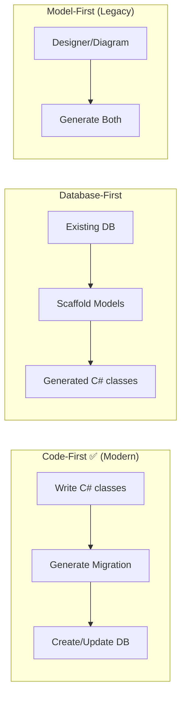
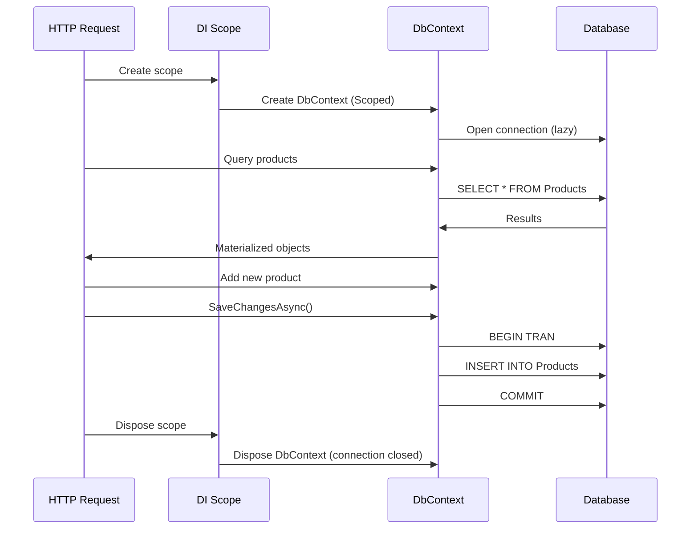
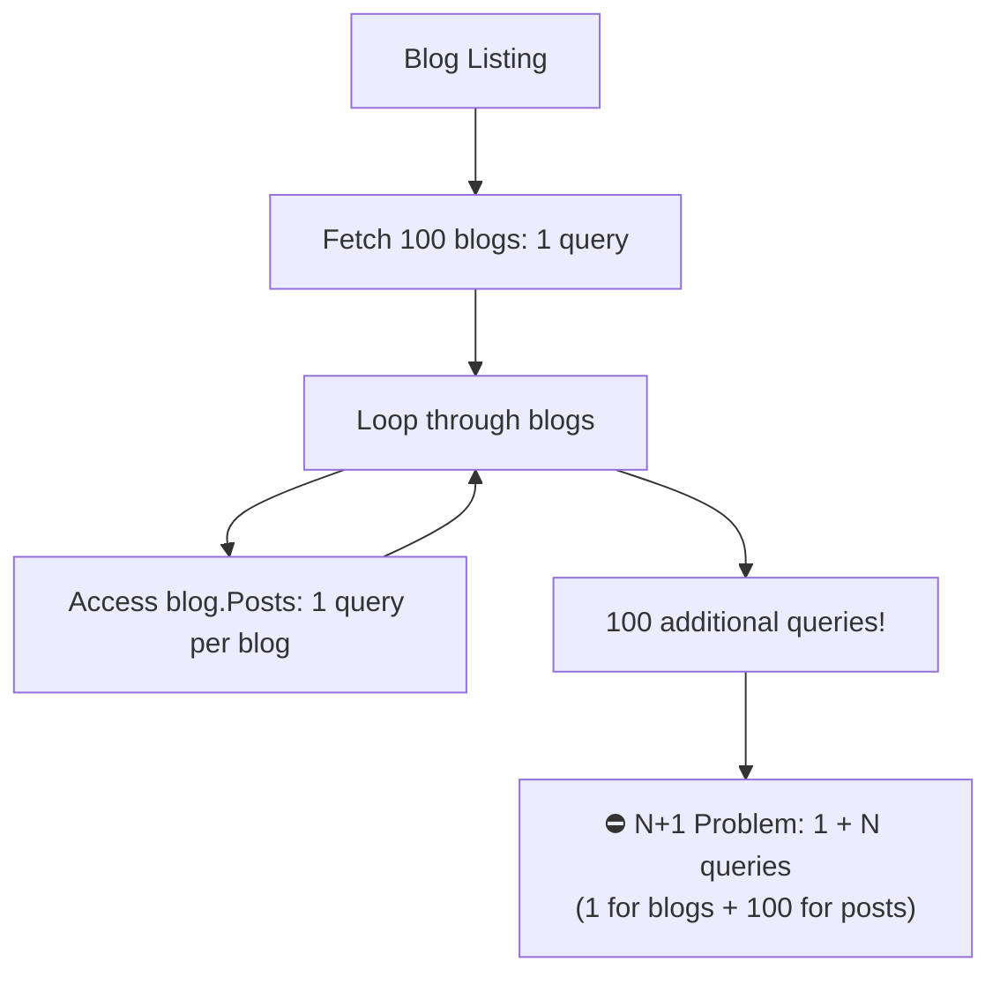

# 04 — Entity Framework Core ⭐ Deep Dive

> **Prerequisite:** You understand ORMs (Hibernate/JPA). EF Core is .NET's answer to Hibernate — but with a **LINQ-first** approach.

---

## 1. What is Entity Framework Core?

EF Core is an **object-relational mapper** (ORM) that lets you work with databases using .NET objects.

```
Tables/Views/Procs  ←→  C# Objects (Entities)
        ↓                   ↓
     SQL Server         DbContext + DbSet
     PostgreSQL         LINQ Queries
     MySQL              Migrations
     SQLite
     InMemory (testing)
```

> **Java analogy:** EF Core = Hibernate / JPA.  
> **Difference:** EF Core uses **LINQ** (not JPQL/HQL) for queries — you write C# code, not strings.

---

## 2. The Three Approaches



**Use Code-First for new projects.**

---

## 3. Your First Entity & DbContext

```bash
dotnet new console -n EfDemo
cd EfDemo
dotnet add package Microsoft.EntityFrameworkCore.SqlServer
# or for PostgreSQL:
# dotnet add package Npgsql.EntityFrameworkCore.PostgreSQL
```

### 3.1 The Entity (Your Model)

```csharp
public class Product {
    public int Id { get; set; }            // PK (convention: Id or ProductId)
    public string Name { get; set; }       // Required string
    public decimal Price { get; set; }     // Decimal for money
    public int CategoryId { get; set; }    // FK
    public Category Category { get; set; } // Navigation property

    public DateTime CreatedAt { get; set; }
    public bool IsDeleted { get; set; }    // Soft delete flag
}

public class Category {
    public int Id { get; set; }
    public string Name { get; set; }
    public ICollection<Product> Products { get; set; }  // Navigation — 1:N
}
```

### 3.2 The DbContext (Your Database Session)

```csharp
public class AppDbContext : DbContext {
    public AppDbContext(DbContextOptions<AppDbContext> options) : base(options) { }

    // DbSet = Table
    public DbSet<Product> Products => Set<Product>();
    public DbSet<Category> Categories => Set<Category>();

    protected override void OnModelCreating(ModelBuilder modelBuilder) {
        // Fluent API configuration (alternative to attributes)
        modelBuilder.Entity<Product>(entity => {
            entity.ToTable("Products");
            entity.HasKey(p => p.Id);
            entity.Property(p => p.Name).HasMaxLength(200).IsRequired();
            entity.Property(p => p.Price).HasColumnType("decimal(18,2)");
            entity.HasOne(p => p.Category)
                  .WithMany(c => c.Products)
                  .HasForeignKey(p => p.CategoryId);
            entity.HasQueryFilter(p => !p.IsDeleted);  // Global query filter
        });
    }
}
```

### 3.3 Registration in DI

```csharp
// Program.cs
builder.Services.AddDbContext<AppDbContext>(options =>
    options.UseSqlServer(builder.Configuration.GetConnectionString("DefaultConnection")));
    // options.UseNpgsql(connectionString);  // For PostgreSQL
```

**Lifetime:** `AddDbContext` registers your `DbContext` as **Scoped** (1 per request).

---

## 4. Entity Configuration — 3 Ways

### 4.1 By Convention (No config needed)

```csharp
public class Product {
    public int Id { get; set; }           // → PK, auto-increment
    public string Name { get; set; }       // → nvarchar(max), nullable
    public int CategoryId { get; set; }    // → FK detected by name
    public Category Category { get; set; } // → Navigation property
}
```

### 4.2 Data Annotations (Attributes)

```csharp
[Table("Products")]
public class Product {
    [Key]
    [DatabaseGenerated(DatabaseGeneratedOption.Identity)]
    public int Id { get; set; }

    [Required]
    [MaxLength(200)]
    public string Name { get; set; }

    [Column(TypeName = "decimal(18,2)")]
    public decimal Price { get; set; }

    [ForeignKey(nameof(Category))]
    public int CategoryId { get; set; }

    [InverseProperty(nameof(Category.Products))]
    public Category Category { get; set; }
}
```

### 4.3 Fluent API (Most Powerful — in `OnModelCreating`)

```csharp
protected override void OnModelCreating(ModelBuilder modelBuilder) {
    modelBuilder.Entity<Product>(entity => {
        entity.ToTable("Products");
        entity.HasKey(p => p.Id);
        entity.Property(p => p.Name)
              .HasMaxLength(200)
              .IsRequired();
        entity.Property(p => p.Price)
              .HasColumnType("decimal(18,2)")
              .HasDefaultValue(0);
        entity.HasOne(p => p.Category)
              .WithMany(c => c.Products)
              .HasForeignKey(p => p.CategoryId)
              .OnDelete(DeleteBehavior.Restrict);
        entity.HasIndex(p => p.Name)
              .IsUnique();
    });
}
```

---

## 5. Relationships — The Complete Guide

```csharp
public class Blog {
    public int Id { get; set; }
    public string Title { get; set; }

    // 1:N — Blog has many Posts
    public ICollection<Post> Posts { get; set; } = new List<Post>();

    // 1:1 — Blog has one HeaderImage
    public BlogImage? HeaderImage { get; set; }
}

public class Post {
    public int Id { get; set; }
    public string Content { get; set; }
    public int BlogId { get; set; }            // FK (required)
    public Blog Blog { get; set; }              // Navigation

    public int? AuthorId { get; set; }          // Optional FK
    public Author? Author { get; set; }

    // N:N — Post has many Tags, Tag has many Posts
    public ICollection<Tag> Tags { get; set; } = new List<Tag>();
}

public class Tag {
    public int Id { get; set; }
    public string Name { get; set; }
    public ICollection<Post> Posts { get; set; } = new List<Post>();
}

public class BlogImage {
    public int Id { get; set; }
    public string Url { get; set; }
    public int BlogId { get; set; }             // FK for 1:1
    public Blog Blog { get; set; }
}
```

### Relationship Configuration (Fluent API)

```csharp
protected override void OnModelCreating(ModelBuilder modelBuilder) {
    // 1:N — Blog → Posts
    modelBuilder.Entity<Post>()
        .HasOne(p => p.Blog)
        .WithMany(b => b.Posts)
        .HasForeignKey(p => p.BlogId);

    // 1:1 — Blog → BlogImage
    modelBuilder.Entity<Blog>()
        .HasOne(b => b.HeaderImage)
        .WithOne(i => i.Blog)
        .HasForeignKey<BlogImage>(i => i.BlogId);

    // N:N — Post ↔ Tag (EF Core 5+ auto-creates join table)
    modelBuilder.Entity<Post>()
        .HasMany(p => p.Tags)
        .WithMany(t => t.Posts)
        .UsingEntity(j => j.ToTable("PostTags"));  // Custom join table name
}
```

---

## 6. The `DbContext` Lifecycle



**Key rule:** Never manually dispose `DbContext`. The DI container handles it.

---

## 7. CRUD Operations with EF Core

### 7.1 Create

```csharp
public async Task<Product> CreateAsync(CreateProductDto dto) {
    var product = new Product {
        Name = dto.Name,
        Price = dto.Price,
        CategoryId = dto.CategoryId
    };

    _context.Products.Add(product);          // Tracked as Added
    await _context.SaveChangesAsync();       // INSERT

    return product;  // Now has Id populated
}

// You can also:
_context.Add(product);           // EF figures out the DbSet from the type
_context.Entry(product).State = EntityState.Added;  // Explicit state
```

### 7.2 Read

```csharp
// Get by PK
var product = await _context.Products.FindAsync(id);

// First or default
var product = await _context.Products.FirstOrDefaultAsync(p => p.Id == id);

// All
var products = await _context.Products.ToListAsync();

// Count
var count = await _context.Products.CountAsync();

// Any
var exists = await _context.Products.AnyAsync(p => p.Name == name);

// Single (throws if not exactly one)
var product = await _context.Products.SingleAsync(p => p.Id == id);
```

### 7.3 Update

```csharp
// Approach 1: Tracked entity
var product = await _context.Products.FindAsync(id);
product.Name = "Updated Name";              // EF tracks changes
await _context.SaveChangesAsync();          // UPDATE

// Approach 2: Untracked entity (e.g., from DTO)
var product = new Product { Id = id, Name = dto.Name, Price = dto.Price };
_context.Products.Update(product);          // Marks ALL properties as modified
await _context.SaveChangesAsync();

// Approach 3: Selective update (better for performance)
var product = new Product { Id = id };
_context.Products.Attach(product);           // Track, but Unchanged
product.Name = dto.Name;                     // Only Name is Modified
await _context.SaveChangesAsync();           // UPDATE SET Name = @p1 WHERE Id = @p2
```

### 7.4 Delete

```csharp
// Approach 1: Find then delete
var product = await _context.Products.FindAsync(id);
if (product is not null) {
    _context.Products.Remove(product);
    await _context.SaveChangesAsync();
}

// Approach 2: Stub entity (1 query instead of 2)
var product = new Product { Id = id };
_context.Products.Attach(product);
_context.Products.Remove(product);           // Marked as Deleted
await _context.SaveChangesAsync();           // DELETE

// Approach 3: Soft delete (recommended)
product.IsDeleted = true;
await _context.SaveChangesAsync();
```

---

## 8. Migrations — Schema Evolution

```bash
# Install EF CLI tools
dotnet tool install --global dotnet-ef

# Create initial migration
dotnet ef migrations add InitialCreate

# Apply to database
dotnet ef database update

# Create another migration
dotnet ef migrations add AddProductDescription

# Remove last migration (not yet applied)
dotnet ef migrations remove

# Generate SQL script
dotnet ef migrations script

# Apply to specific migration
dotnet ef database update InitialCreate  # Rollback
```

### Migration File Example

```csharp
// Migrations/20240101000000_InitialCreate.cs
public partial class InitialCreate : Migration {
    protected override void Up(MigrationBuilder migrationBuilder) {
        migrationBuilder.CreateTable(
            name: "Categories",
            columns: table => new {
                Id = table.Column<int>(type: "int", nullable: false)
                    .Annotation("SqlServer:Identity", "1, 1"),
                Name = table.Column<string>(type: "nvarchar(200)", nullable: false)
            },
            constraints: table => {
                table.PrimaryKey("PK_Categories", x => x.Id);
            });

        migrationBuilder.CreateTable(
            name: "Products",
            columns: table => new {
                Id = table.Column<int>(type: "int", nullable: false)
                    .Annotation("SqlServer:Identity", "1, 1"),
                Name = table.Column<string>(maxLength: 200, nullable: false),
                Price = table.Column<decimal>(type: "decimal(18,2)", nullable: false),
                CategoryId = table.Column<int>(nullable: false)
            },
            constraints: table => {
                table.PrimaryKey("PK_Products", x => x.Id);
                table.ForeignKey(
                    name: "FK_Products_Categories_CategoryId",
                    column: x => x.CategoryId,
                    principalTable: "Categories",
                    principalColumn: "Id");
            });
    }

    protected override void Down(MigrationBuilder migrationBuilder) {
        migrationBuilder.DropTable(name: "Products");
        migrationBuilder.DropTable(name: "Categories");
    }
}
```

---

## 9. Loading Related Data — The 3 Ways

### 9.1 Eager Loading (Include) ⭐ Default — always prefer this

```csharp
var blogs = await _context.Blogs
    .Include(b => b.Posts)              // JOIN Posts
        .ThenInclude(p => p.Tags)       // JOIN PostTags → Tags
    .Include(b => b.HeaderImage)         // JOIN BlogImages (if any)
    .ToListAsync();

// Generates SQL like:
// SELECT * FROM Blogs
// JOIN Posts ON Blogs.Id = Posts.BlogId
// LEFT JOIN PostTags ON Posts.Id = PostTags.PostId
// JOIN Tags ON PostTags.TagsId = Tags.Id
// LEFT JOIN BlogImages ON Blogs.Id = BlogImages.BlogId
```

### 9.2 Explicit Loading (for specific scenarios)

```csharp
var blog = await _context.Blogs.FindAsync(1);

// Explicitly load navigation
await _context.Entry(blog)
    .Collection(b => b.Posts)
    .LoadAsync();

// Explicitly load reference
await _context.Entry(blog)
    .Reference(b => b.HeaderImage)
    .LoadAsync();
```

### 9.3 Lazy Loading (❌ Avoid — causes N+1)

```csharp
// Must install: dotnet add package Microsoft.EntityFrameworkCore.Proxies

builder.Services.AddDbContext<AppDbContext>(options =>
    options.UseLazyLoadingProxies()              // Enable proxies
           .UseSqlServer(connectionString));

// Navigation properties must be virtual
public class Blog {
    public int Id { get; set; }
    public virtual ICollection<Post> Posts { get; set; }  // virtual → proxy
}
```



**Rule of thumb:** Always use `Include` (Eager Loading). Never use Lazy Loading in production.

---

## 10. Query Filters & Shadow Properties

### 10.1 Global Query Filters (Soft Delete)

```csharp
protected override void OnModelCreating(ModelBuilder modelBuilder) {
    modelBuilder.Entity<Product>().HasQueryFilter(p => !p.IsDeleted);
    modelBuilder.Entity<Category>().HasQueryFilter(c => !c.IsDeleted);
}

// Now EVERY query to Products/Categories automatically filters:
// SELECT * FROM Products WHERE IsDeleted = 0

// To bypass:
var allProducts = await _context.Products
    .IgnoreQueryFilters()
    .ToListAsync();
```

### 10.2 Shadow Properties (Column in DB, not in C#)

```csharp
// In OnModelCreating:
modelBuilder.Entity<Product>().Property<DateTime>("LastModified");

// Set via EF:
_context.Entry(product).Property("LastModified").CurrentValue = DateTime.UtcNow;

// Query via EF:
var products = await _context.Products
    .Where(p => EF.Property<DateTime>(p, "LastModified") > lastWeek)
    .ToListAsync();
```

---

## 11. Performance — The Critical Checklist

```csharp
// ❌ BAD: N+1 queries
foreach (var blog in blogs) {
    Console.WriteLine(blog.Posts.Count);  // 1 query per blog!
}

// ✅ GOOD: Eager load
var blogs = await _context.Blogs.Include(b => b.Posts).ToListAsync();

// ❌ BAD: SELECT * when you need 1 column
var names = await _context.Products.Select(p => p.Name).ToListAsync();

// ✅ GOOD: Project only what you need
var productDtos = await _context.Products
    .Select(p => new ProductDto { Id = p.Id, Name = p.Name })
    .ToListAsync();

// ❌ BAD: No tracking for read-only data
var products = await _context.Products.ToListAsync();  // Tracked by default

// ✅ GOOD: AsNoTracking for read-only
var products = await _context.Products
    .AsNoTracking()
    .ToListAsync();

// ❌ BAD: Split queries = extra round trips
var blogs = await _context.Blogs.Include(b => b.Posts).ToListAsync();

// ✅ GOOD: Single query with split behavior (EF Core 5+)
var blogs = await _context.Blogs.Include(b => b.Posts)
    .AsSplitQuery()  // Multiple queries but avoids cartesian explosion
    .ToListAsync();

// ❌ BAD: Loading too much data into memory
var expensive = products.Where(p => p.Price > 100).ToList();  // All loaded!

// ✅ GOOD: Filter in database
var expensive = await _context.Products
    .Where(p => p.Price > 100)
    .ToListAsync();  // Only matching rows
```

---

## 12. Transactions

```csharp
// Automatic — SaveChanges wraps in a transaction
await _context.SaveChangesAsync();

// Explicit — multiple operations in one transaction
using var transaction = await _context.Database.BeginTransactionAsync();
try {
    _context.Products.Add(new Product { Name = "New", Price = 10 });
    await _context.SaveChangesAsync();

    _context.Categories.Add(new Category { Name = "New Category" });
    await _context.SaveChangesAsync();

    await transaction.CommitAsync();
} catch {
    await transaction.RollbackAsync();
    throw;
}
```

---

## 13. Complete Real-World Example

```csharp
// IProductRepository.cs
public interface IProductRepository {
    Task<Product?> GetByIdAsync(int id);
    Task<List<Product>> GetAllAsync(string? search, decimal? minPrice, decimal? maxPrice);
    Task<Product> CreateAsync(Product product);
    Task UpdateAsync(Product product);
    Task DeleteAsync(int id);
}

// ProductRepository.cs
public class ProductRepository : IProductRepository {
    private readonly AppDbContext _context;

    public ProductRepository(AppDbContext context) {
        _context = context;
    }

    public async Task<Product?> GetByIdAsync(int id) {
        return await _context.Products
            .Include(p => p.Category)
            .FirstOrDefaultAsync(p => p.Id == id);
    }

    public async Task<List<Product>> GetAllAsync(
        string? search, decimal? minPrice, decimal? maxPrice)
    {
        var query = _context.Products
            .Include(p => p.Category)
            .AsNoTracking()
            .AsQueryable();

        if (!string.IsNullOrWhiteSpace(search))
            query = query.Where(p => p.Name.Contains(search));

        if (minPrice.HasValue)
            query = query.Where(p => p.Price >= minPrice.Value);

        if (maxPrice.HasValue)
            query = query.Where(p => p.Price <= maxPrice.Value);

        return await query.OrderBy(p => p.Name).ToListAsync();
    }

    public async Task<Product> CreateAsync(Product product) {
        _context.Products.Add(product);
        await _context.SaveChangesAsync();
        return product;
    }

    public async Task UpdateAsync(Product product) {
        _context.Products.Update(product);
        await _context.SaveChangesAsync();
    }

    public async Task DeleteAsync(int id) {
        var product = await _context.Products.FindAsync(id);
        if (product is not null) {
            _context.Products.Remove(product);
            await _context.SaveChangesAsync();
        }
    }
}
```

---

## 14. Configuration Reference

```csharp
// In Program.cs — different providers
builder.Services.AddDbContext<AppDbContext>(options => {
    // SQL Server
    options.UseSqlServer(connectionString);

    // PostgreSQL
    options.UseNpgsql(connectionString);

    // SQLite (development)
    options.UseSqlite("Data Source=app.db");

    // InMemory (testing)
    options.UseInMemoryDatabase("TestDb");

    // MySQL
    options.UseMySql(connectionString, ServerVersion.AutoDetect(connectionString));

    // Options always available
    options.EnableSensitiveDataLogging();     // Show parameter values in logs
    options.EnableDetailedErrors();           // More detailed error messages
    options.LogTo(Console.WriteLine);          // Log SQL to console
});
```

---

## 15. Key Takeaways

| Concept | Key Point |
|---------|-----------|
| **Code-First** | Write C# → EF generates DB |
| **DbContext** | Your DB session — Scoped lifetime |
| **Migrations** | `add-migration` + `database update` |
| **Include/ThenInclude** | Always eager load to avoid N+1 |
| **AsNoTracking** | Use for read-only queries |
| **SaveChanges** | Call ONCE per logical operation |
| **Global Filters** | Great for soft delete / multi-tenant |
| **Shadow Properties** | DB columns without C# properties |

> **🎯 Exercise:**
> 1. Create a Blogging API with `Blog`, `Post`, `Tag` entities
> 2. Configure all 3 relationship types (1:1, 1:N, N:N)
> 3. Create a migration, update the database
> 4. Write a query that: Gets all blogs with their posts and tags using `Include`
> 5. Write a filter query that searches posts by content text
> 6. Add a global query filter for soft delete
