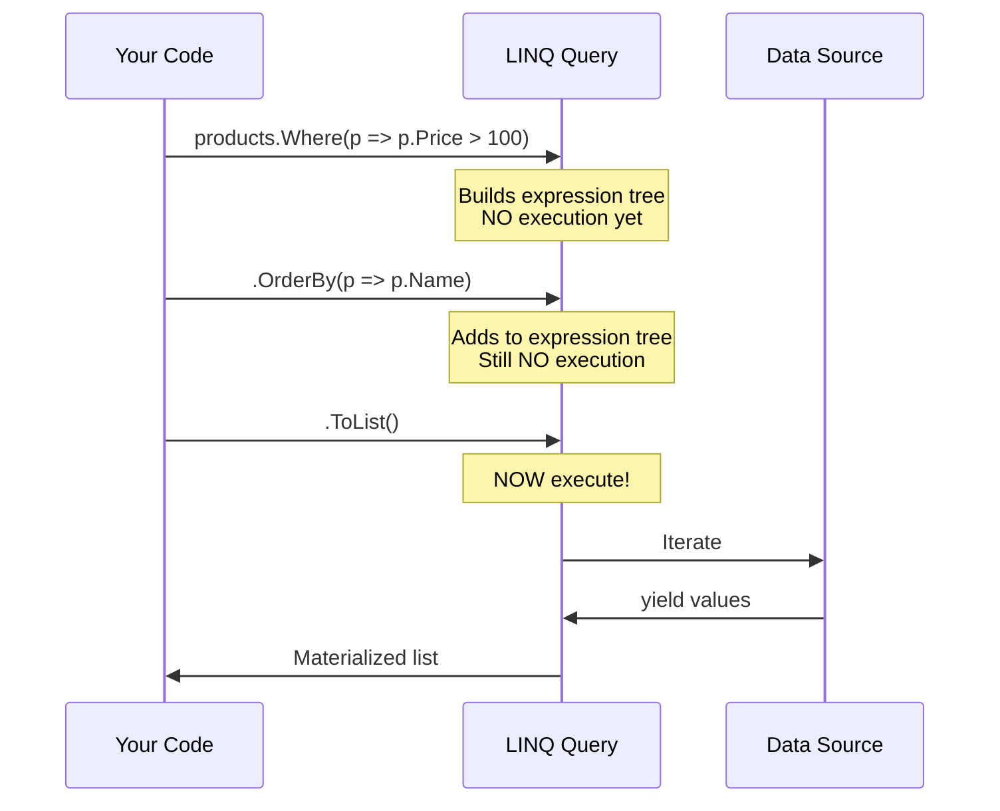
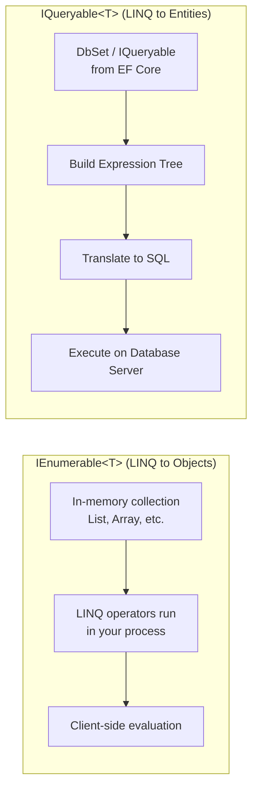

# 05 — LINQ Deep Dive ⭐ (Language Integrated Query)

> **Prerequisite:** You know Java Streams API. LINQ is **Streams on steroids** — it works everywhere (not just collections) and has two syntax flavors.

---

## 1. What is LINQ?

**Language INtegrated Query** — query any data source (objects, databases, XML, JSON) using the same C# syntax.

```csharp
// Same LINQ query works on:
var fromMemory = products.Where(p => p.Price > 100);  // In-memory list
var fromDb     = dbContext.Products.Where(p => p.Price > 100);  // SQL database
var fromXml    = xmlDoc.Descendants("Product").Where(...);       // XML
```

> **Java analogy:** `products.stream().filter(p -> p.getPrice() > 100).collect(toList())`  
> **C# LINQ:** `products.Where(p => p.Price > 100).ToList()`

**The magic:** The **same** `Where`, `Select`, `OrderBy` methods work on **any** data source because of **extension methods** and **IEnumerable<T> / IQueryable<T>**.

---

## 2. The Two Syntaxes

### 2.1 Method Syntax (Fluent) — ⭐ Preferred

```csharp
var result = products
    .Where(p => p.Price > 100)
    .OrderByDescending(p => p.Price)
    .Select(p => new { p.Name, p.Price })
    .ToList();
```

### 2.2 Query Syntax (SQL-like)

```csharp
var result = from p in products
             where p.Price > 100
             orderby p.Price descending
             select new { p.Name, p.Price };

var list = result.ToList();  // Deferred execution!
```

**Rule of thumb:** Method syntax is more powerful (supports all operators). Query syntax is readable for joins. **Know both, prefer method.**

---

## 3. Core LINQ Operators — With 15+ Examples

### 3.1 Filtering

```csharp
// Where — filter by condition
var expensive = products.Where(p => p.Price > 100);
var specific  = products.Where(p => p.Name.Contains("Pro") && p.Price < 500);

// OfType — filter by type
var numbers = new object[] { 1, "two", 3, "four" };
var justInts = numbers.OfType<int>();  // [1, 3]
```

### 3.2 Projection (Mapping)

```csharp
// Select — transform each element
var names = products.Select(p => p.Name);
var dtos = products.Select(p => new ProductDto { Name = p.Name, Price = p.Price });
var anonymous = products.Select(p => new { p.Name, p.Price });  // Anonymous type

// SelectMany — flatten nested collections (like flatMap)
var allTags = blogs.SelectMany(b => b.Posts.SelectMany(p => p.Tags));
// Without SelectMany = nested loop
var tagsOld = blogs.Select(b => b.Posts.Select(p => p.Tags));  // IEnumerable<IEnumerable<IEnumerable<Tag>>>

// Select with index
var indexed = products.Select((p, i) => $"{i + 1}. {p.Name}");
```

### 3.3 Ordering

```csharp
var sorted = products.OrderBy(p => p.Name);           // Ascending
var sortedDesc = products.OrderByDescending(p => p.Price);

// ThenBy — secondary sort
var sorted = products
    .OrderBy(p => p.CategoryId)
    .ThenByDescending(p => p.Price);  // By category, then by price desc
```

### 3.4 Grouping

```csharp
// GroupBy — like SQL GROUP BY
var byCategory = products.GroupBy(p => p.CategoryId);

foreach (var group in byCategory) {
    Console.WriteLine($"Category {group.Key}: {group.Count()} products");
    foreach (var product in group) {
        Console.WriteLine($"  - {product.Name}");
    }
}

// Multiple keys
var byCategoryAndPrice = products.GroupBy(p => new { p.CategoryId, IsExpensive = p.Price > 100 });
```

### 3.5 Joins

```csharp
// Inner Join
var query = products.Join(
    categories,                        // Inner sequence
    p => p.CategoryId,                 // Outer key selector
    c => c.Id,                         // Inner key selector
    (p, c) => new { p.Name, Category = c.Name }  // Result selector
);

// Left Join (GroupJoin + SelectMany + DefaultIfEmpty)
var query = categories.GroupJoin(
    products,
    c => c.Id,
    p => p.CategoryId,
    (c, ps) => new { Category = c.Name, Products = ps.DefaultIfEmpty() }
).SelectMany(x => x.Products.Select(p => new { x.Category, Product = p?.Name ?? "(none)" }));

// Left Join (.NET 10+ — built-in operator)
var query = products.LeftJoin(
    categories,
    p => p.CategoryId,
    c => c.Id,
    (p, c) => new { Product = p.Name, Category = c?.Name ?? "(none)" }
);

// INNER JOIN using Query Syntax (more readable)
var query = from p in products
            join c in categories on p.CategoryId equals c.Id
            select new { p.Name, Category = c.Name };
```

### 3.6 Set Operations

```csharp
var set1 = new[] { 1, 2, 3, 4, 5 };
var set2 = new[] { 4, 5, 6, 7, 8 };

var union     = set1.Union(set2);           // [1, 2, 3, 4, 5, 6, 7, 8]
var intersect = set1.Intersect(set2);       // [4, 5]
var except    = set1.Except(set2);          // [1, 2, 3]
var distinct  = set1.Distinct();            // [1, 2, 3, 4, 5]
```

### 3.7 Aggregation

```csharp
var numbers = new[] { 1, 2, 3, 4, 5 };

numbers.Count();              // 5
numbers.Count(n => n > 3);    // 2
numbers.Sum();                // 15
numbers.Average();            // 3
numbers.Min();                // 1
numbers.Max();                // 5

// Aggregate — custom accumulation
var result = numbers.Aggregate((a, b) => a * b);    // 120 (1*2*3*4*5)

// With seed
var result2 = numbers.Aggregate(10, (a, b) => a + b);  // 25 (10+1+2+3+4+5)
```

### 3.8 Quantifiers

```csharp
var anyExpensive = products.Any(p => p.Price > 1000);     // true/false
var allInStock   = products.All(p => p.Quantity > 0);      // true/false
var contains     = products.Contains(product);              // true/false (uses Equals)
```

### 3.9 Element Operators

```csharp
var first     = products.First();                         // Exception if empty
var firstOr   = products.FirstOrDefault();                 // null/default if empty
var last      = products.Last(p => p.Price > 100);         // Exception if none
var single    = products.Single(p => p.Id == 5);           // Exactly ONE
var singleOr  = products.SingleOrDefault(p => p.Id == 5);  // ONE or zero
var elementAt = products.ElementAt(3);                      // Index
var elementOr = products.ElementAtOrDefault(100);           // null if out of range
```

### 3.10 Partitioning

```csharp
var first3 = products.Take(3);          // First 3
var skip2  = products.Skip(2);          // Skip first 2

// Pagination
var page2 = products.Skip(10).Take(10);  // Page 2, size 10

// TakeWhile / SkipWhile
var below100 = products.TakeWhile(p => p.Price < 100);    // Take until condition fails
var after100 = products.SkipWhile(p => p.Price < 100);    // Skip until condition fails

// Chunk (.NET 6+)
var chunks = numbers.Chunk(3);           // [[1,2,3], [4,5]]
```

---

## 4. Deferred Execution — The Most Important Concept

```csharp
// ❌ Common mistake:
var query = products.Where(p => p.Price > 100);
// At this point, NO query has executed!

products.Add(new Product { Name = "New", Price = 200 });

var results = query.ToList();  // ← Query executes HERE
// "New" is INCLUDED because Where was deferred!
```



### When does execution happen?

| Method | Execution | Category |
|--------|-----------|----------|
| `Where`, `Select`, `OrderBy`, `GroupBy`, `Join` | **Deferred** | Build query |
| `ToList()`, `ToArray()`, `ToDictionary()` | **Immediate** | Materialize |
| `First()`, `Single()`, `Count()`, `Any()` | **Immediate** | Single value |
| `FirstOrDefault()`, `SingleOrDefault()` | **Immediate** | Single or default |

```csharp
// Deferred — chains
var query = products
    .Where(p => p.Price > 100)       // Deferred
    .OrderBy(p => p.Name)            // Deferred
    .Select(p => p.Name);            // Deferred

// Immediate — triggers execution
var list   = query.ToList();          // Executes NOW
var first  = query.First();          // Executes NOW
var count  = query.Count();          // Executes NOW
```

---

## 5. IEnumerable<T> vs IQueryable<T> — Database vs Memory



```csharp
// IQueryable — SQL on server
var query = dbContext.Products
    .Where(p => p.Price > 100)      // Adds WHERE to SQL
    .OrderBy(p => p.Name)           // Adds ORDER BY to SQL
    .Select(p => new { p.Name });   // Adds SELECT to SQL

// Executes as: SELECT [p].[Name] FROM [Products] AS [p] WHERE [p].[Price] > 100 ORDER BY [p].[Name]

// IEnumerable — in memory
var inMemory = products.Where(p => p.Price > 100);  // Loads ALL products first!

// ⛔ BAD: This loads ALL rows into memory before filtering!
var bad = dbContext.Products.ToList()       // SELECT * → in memory
    .Where(p => p.Price > 100)              // Filter in .NET
    .ToList();

// ✅ GOOD: This filters in the database!
var good = dbContext.Products
    .Where(p => p.Price > 100)              // Adds WHERE to SQL
    .ToList();                              // SELECT ... WHERE Price > 100
```

### The ToList() Trap

```csharp
// ❌ BAD — filtering after materialization
var allProducts = dbContext.Products.ToList();           // ALL rows to memory
var filtered = allProducts.Where(p => p.CategoryId == 5);  // Filter in .NET

// ✅ GOOD — filter before materialization
var filtered = dbContext.Products
    .Where(p => p.CategoryId == 5)  // WHERE in SQL
    .ToList();                       // Only matching rows to memory
```

---

## 6. LINQ with EF Core — What Translates to SQL

```csharp
// ✅ These translate to SQL:
.Where(p => p.Name == "Pro")                          // WHERE Name = 'Pro'
.Where(p => p.Name.Contains("Pro"))                   // WHERE Name LIKE '%Pro%'
.Where(p => p.Price > 100)                            // WHERE Price > 100
.OrderBy(p => p.Name)                                 // ORDER BY Name
.Select(p => new { p.Name, p.Price })                 // SELECT Name, Price
.GroupBy(p => p.CategoryId)                           // GROUP BY CategoryId
.Select(p => new { FullName = p.Name + " " + p.Sku }) // SQL CONCAT
.Count(), .Any(), .First()                            // SQL aggregate / TOP

// ❌ These do NOT translate (client-evaluated — WARNING):
.Where(p => p.MyMethod())                    // Custom method → client eval
.Select(p => new { p.Name, Compute(p) })      // Custom computation → client eval
.Where(p => p.Name == SomePropertyFromThisClass)  // Instance method property → compile OK
```

---

## 7. LINQ with EF Core — Performance Patterns

```csharp
// ❌ Client evaluation warning
var products = dbContext.Products
    .Where(p => p.Category.Name.StartsWith("E"))  // OK — translates to SQL
    .ToList()
    .Where(p => MyCustomFilter(p));                // Client eval — prints WARNING!

// ✅ Fix: Keep everything in SQL
var products = dbContext.Products
    .Include(p => p.Category)
    .Where(p => p.Category.Name.StartsWith("E"))
    .Where(p => p.Price > 100)                     // All in SQL
    .ToList();
```

---

## 8. Advanced LINQ Patterns

### 8.1 Zip — Combine two sequences pairwise

```csharp
var names = new[] { "Alice", "Bob", "Charlie" };
var ages  = new[] { 30, 25, 35 };

var people = names.Zip(ages, (name, age) => new { Name = name, Age = age });
// [{ Name = "Alice", Age = 30 }, { Name = "Bob", Age = 25 }, ...]
```

### 8.2 ToLookup — One-to-many dictionary

```csharp
var lookup = products.ToLookup(p => p.CategoryId);
// Like GroupBy, but immediate execution and O(1) access
var electronics = lookup[1];  // All products in category 1
```

### 8.3 Let / Into (Query Syntax)

```csharp
var query = from p in products
            let discountedPrice = p.Price * 0.9m   // Local variable in query
            where discountedPrice > 50
            select new { p.Name, discountedPrice };
```

### 8.4 Custom Extension Methods

```csharp
public static class LinqExtensions {
    // Paginate any IQueryable
    public static IQueryable<T> Paginate<T>(this IQueryable<T> source, int page, int size) {
        return source.Skip((page - 1) * size).Take(size);
    }

    // Random element
    public static T? RandomElement<T>(this IEnumerable<T> source) {
        var list = source.ToList();
        return list.Count == 0 ? default : list[Random.Shared.Next(list.Count)];
    }
}

// Usage:
var page2 = dbContext.Products.Paginate(2, 10).ToList();
var random = products.RandomElement();
```

---

## 9. LINQ vs Java Streams — Side by Side

| Operation | Java Streams | C# LINQ |
|-----------|-------------|---------|
| Filter | `.filter(p -> p.price > 100)` | `.Where(p => p.Price > 100)` |
| Map | `.map(p -> p.name)` | `.Select(p => p.Name)` |
| FlatMap | `.flatMap(p -> p.tags.stream())` | `.SelectMany(p => p.Tags)` |
| Sorted | `.sorted(Comparator.comparing(p -> p.price))` | `.OrderBy(p => p.Price)` |
| forEach | `.forEach(System.out::println)` | `.ToList().ForEach(Console.WriteLine)` |
| Collect | `.collect(Collectors.toList())` | `.ToList()` |
| GroupBy | `.collect(Collectors.groupingBy(p -> p.category))` | `.GroupBy(p => p.Category)` |
| Reduce | `.reduce(0, Integer::sum)` | `.Aggregate(0, (a, b) => a + b)` |
| AnyMatch | `.anyMatch(p -> p.price > 100)` | `.Any(p => p.Price > 100)` |
| AllMatch | `.allMatch(p -> p.price > 0)` | `.All(p => p.Price > 0)` |
| FindFirst | `.findFirst()` | `.FirstOrDefault()` |
| Limit | `.limit(10)` | `.Take(10)` |
| Skip | `.skip(10)` | `.Skip(10)` |
| Distinct | `.distinct()` | `.Distinct()` |
| Peek | `.peek(System.out::println)` | `.Select(p => { Console.WriteLine(p); return p; })` |
| Method Ref | `String::toUpperCase` | `x => x.ToUpper()` |

---

## 10. LINQ Daily Patterns — Real Code You'll Write

### Pagination

```csharp
public async Task<PagedResult<ProductDto>> GetProductsAsync(int page, int size) {
    var query = _context.Products.AsNoTracking();

    var total = await query.CountAsync();
    var items = await query
        .OrderBy(p => p.Id)
        .Skip((page - 1) * size)
        .Take(size)
        .Select(p => new ProductDto { Id = p.Id, Name = p.Name, Price = p.Price })
        .ToListAsync();

    return new PagedResult<ProductDto> {
        Items = items,
        Total = total,
        Page = page,
        Size = size,
        TotalPages = (int)Math.Ceiling(total / (double)size)
    };
}
```

### Aggregation Report

```csharp
var report = await _context.Products
    .GroupBy(p => p.CategoryId)
    .Select(g => new {
        CategoryId = g.Key,
        Count = g.Count(),
        TotalValue = g.Sum(p => p.Price * p.Quantity),
        AveragePrice = g.Average(p => p.Price),
        MinPrice = g.Min(p => p.Price),
        MaxPrice = g.Max(p => p.Price)
    })
    .ToListAsync();
```

### Search with Multiple Filters

```csharp
public async Task<List<ProductDto>> SearchProductsAsync(ProductSearchRequest request) {
    var query = _context.Products
        .Include(p => p.Category)
        .AsNoTracking()
        .AsQueryable();

    if (!string.IsNullOrWhiteSpace(request.SearchText))
        query = query.Where(p =>
            p.Name.Contains(request.SearchText) ||
            p.Description.Contains(request.SearchText));

    if (request.CategoryId.HasValue)
        query = query.Where(p => p.CategoryId == request.CategoryId.Value);

    if (request.MinPrice.HasValue)
        query = query.Where(p => p.Price >= request.MinPrice.Value);

    if (request.MaxPrice.HasValue)
        query = query.Where(p => p.Price <= request.MaxPrice.Value);

    if (!string.IsNullOrWhiteSpace(request.SortBy)) {
        query = request.SortBy switch {
            "name" => request.SortDesc ? query.OrderByDescending(p => p.Name)
                                       : query.OrderBy(p => p.Name),
            "price" => request.SortDesc ? query.OrderByDescending(p => p.Price)
                                        : query.OrderBy(p => p.Price),
            _ => query.OrderBy(p => p.Id)
        };
    }

    return await query
        .Select(p => new ProductDto { Id = p.Id, Name = p.Name, Price = p.Price })
        .ToListAsync();
}
```

### Batch Update

```csharp
// Before EF Core 7 — had to load and update one by one
// EF Core 7+ — ExecuteUpdate! (no loading)
await _context.Products
    .Where(p => p.CategoryId == oldCategoryId)
    .ExecuteUpdateAsync(setters => setters.SetProperty(p => p.CategoryId, newCategoryId));

// EF Core 10 — regular lambdas instead of expression trees
await _context.Products
    .Where(p => p.CategoryId == oldCategoryId)
    .ExecuteUpdateAsync(p => {
        p.CategoryId = newCategoryId;
        p.LastModified = DateTime.UtcNow;
    });

// Bulk delete
await _context.Products
    .Where(p => p.IsDeleted && p.CreatedAt < DateTime.UtcNow.AddYears(-1))
    .ExecuteDeleteAsync();
```

---

## 11. Common Mistakes & Pitfalls

| Mistake | Why it's wrong | Fix |
|---------|---------------|-----|
| `.ToList().Where(...)` | Loads everything into memory before filter | `.Where(...).ToList()` |
| Multiple enumeration | Iterating the same IEnumerable twice executes query twice | `.ToList()` once, reuse list |
| `.Count() > 0` instead of `.Any()` | Count enumerates all; Any stops at first | `.Any()` |
| Forgetting `AsNoTracking` | EF tracks all entities (memory + perf overhead) | `.AsNoTracking()` for read-only |
| `.Where(p => p.Price == GetPrice())` | Method calls may not translate to SQL | Use variable: `var price = GetPrice(); ...Where(p => p.Price == price)` |
| `.Select(p => new { p.Property1, p.Property2 }).Distinct()` | Distinct on anonymous type compares ALL properties | Select specific key, then Distinct |
| Not calling `.ToList()` | Query never executes | Add `.ToList()` / `.FirstOrDefault()` / `.Count()` |

---

## 12. Quick Reference Card

```
┌──────────────────────────────────────────────────────────┐
│                    LINQ QUICK REFERENCE                    │
├──────────────────────────────────────────────────────────┤
│ Filtering:     .Where(), .OfType(), .Distinct()          │
│ Projection:    .Select(), .SelectMany()                  │
│ Ordering:      .OrderBy(), .OrderByDescending(),         │
│                .ThenBy(), .ThenByDescending()             │
│ Grouping:      .GroupBy(), .ToLookup()                   │
│ Joining:       .Join(), .LeftJoin(), .GroupJoin(), .Zip()│
│ Aggregation:   .Count(), .Sum(), .Average(), .Min(),     │
│                .Max(), .Aggregate()                       │
│ Quantifiers:   .Any(), .All(), .Contains()               │
│ Elements:      .First(), .Last(), .Single(), .ElementAt() │
│ Partitions:    .Take(), .Skip(), .TakeWhile(),           │
│                .SkipWhile(), .Chunk()                     │
│ Conversion:    .ToList(), .ToArray(), .ToDictionary(),   │
│                .ToHashSet(), .AsEnumerable()              │
│ Execution:     Deferred → .Where(), .Select(), .OrderBy()│
│                Immediate → .ToList(), .Count(), .First() │
└──────────────────────────────────────────────────────────┘
```

## 12. C# 14 / .NET 10 LINQ Additions

### 12.1 Null-Conditional Assignment

C# 14 allows assignment through null-conditional operators:

```csharp
// Before C# 14 — required intermediate variable
if (person?.Address != null) {
    person.Address.City = "New York";
}

// C# 14 — direct null-conditional assignment
person?.Address.City = "New York";  // Only assigns if person?.Address is not null
```

---

> **🎯 Exercise — LINQ Mastery Challenge:**
> 1. Create a `List<Person>` with `Name`, `Age`, `City`
> 2. Write LINQ for each:
>    - All people over 30 in "New York"
>    - Group by city, show count per city
>    - Average age per city
>    - Top 3 oldest people
>    - People whose name starts with "A" — ordered by age
>    - Paginated result (page 2, size 5)
>    - Find if anyone is under 18
>    - Create a lookup by city
> 3. Connect to EF Core: Write the same queries against a database table
> 4. Check the generated SQL to see what translated
