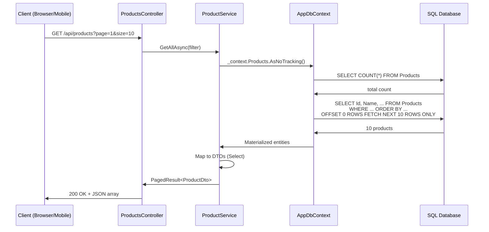

# 06 — Building Web APIs with EF Core + Full CRUD

---

## 1. Clean Architecture Layers

```
Controllers (HTTP concerns)
    ↓
Services (Business logic)
    ↓
Repositories (Data access) [Optional — can go directly to DbContext]
    ↓
EF Core DbContext (ORM)
    ↓
Database
```

> **Your Java analogy:** Controller → Service → Repository → JPA Repository

---

## 2. The Complete API — Product Catalog

### 2.1 Project Setup

```bash
dotnet new webapi -n ProductCatalog
cd ProductCatalog
dotnet add package Microsoft.EntityFrameworkCore.SqlServer
dotnet add package Microsoft.EntityFrameworkCore.Design
dotnet add package AutoMapper.Extensions.Microsoft.DependencyInjection
```

### 2.2 Entity Model

```csharp
// Models/Product.cs
public class Product {
    public int Id { get; set; }
    public string Name { get; set; } = string.Empty;
    public string? Description { get; set; }
    public decimal Price { get; set; }
    public int Quantity { get; set; }
    public int CategoryId { get; set; }
    public Category Category { get; set; } = null!;
    public DateTime CreatedAt { get; set; } = DateTime.UtcNow;
    public bool IsDeleted { get; set; }
}

// Models/Category.cs
public class Category {
    public int Id { get; set; }
    public string Name { get; set; } = string.Empty;
    public string? Description { get; set; }
    public ICollection<Product> Products { get; set; } = new List<Product>();
}
```

### 2.3 DTOs

```csharp
// Models/Dtos/ProductDto.cs
public record ProductDto(
    int Id,
    string Name,
    string? Description,
    decimal Price,
    int Quantity,
    string CategoryName,
    DateTime CreatedAt
);

public record CreateProductDto(
    string Name,
    string? Description,
    decimal Price,
    int Quantity,
    int CategoryId
);

public record UpdateProductDto(
    string Name,
    string? Description,
    decimal Price,
    int Quantity,
    int CategoryId
);

public record ProductFilterDto(
    string? Search,
    int? CategoryId,
    decimal? MinPrice,
    decimal? MaxPrice,
    string? SortBy,
    bool SortDesc,
    int Page = 1,
    int Size = 10
);

public record PagedResult<T>(
    List<T> Items,
    int Total,
    int Page,
    int Size,
    int TotalPages
);
```

### 2.4 DbContext

```csharp
// Data/AppDbContext.cs
public class AppDbContext : DbContext {
    public AppDbContext(DbContextOptions<AppDbContext> options) : base(options) { }

    public DbSet<Product> Products => Set<Product>();
    public DbSet<Category> Categories => Set<Category>();

    protected override void OnModelCreating(ModelBuilder modelBuilder) {
        modelBuilder.Entity<Product>(entity => {
            entity.ToTable("Products");
            entity.HasKey(p => p.Id);
            entity.Property(p => p.Name).HasMaxLength(200).IsRequired();
            entity.Property(p => p.Price).HasColumnType("decimal(18,2)");
            entity.HasOne(p => p.Category)
                  .WithMany(c => c.Products)
                  .HasForeignKey(p => p.CategoryId);
            entity.HasQueryFilter(p => !p.IsDeleted);  // Soft delete
        });

        modelBuilder.Entity<Category>(entity => {
            entity.ToTable("Categories");
            entity.HasKey(c => c.Id);
            entity.Property(c => c.Name).HasMaxLength(100).IsRequired();
        });

        // Seed data
        modelBuilder.Entity<Category>().HasData(
            new Category { Id = 1, Name = "Electronics" },
            new Category { Id = 2, Name = "Books" },
            new Category { Id = 3, Name = "Clothing" }
        );
    }
}
```

### 2.5 Service Layer

```csharp
// Services/IProductService.cs
public interface IProductService {
    Task<ProductDto?> GetByIdAsync(int id);
    Task<PagedResult<ProductDto>> GetAllAsync(ProductFilterDto filter);
    Task<ProductDto> CreateAsync(CreateProductDto dto);
    Task UpdateAsync(int id, UpdateProductDto dto);
    Task DeleteAsync(int id);
}

// Services/ProductService.cs
public class ProductService : IProductService {
    private readonly AppDbContext _context;
    private readonly ILogger<ProductService> _logger;

    public ProductService(AppDbContext context, ILogger<ProductService> logger) {
        _context = context;
        _logger = logger;
    }

    public async Task<ProductDto?> GetByIdAsync(int id) {
        var product = await _context.Products
            .Include(p => p.Category)
            .AsNoTracking()
            .FirstOrDefaultAsync(p => p.Id == id);

        if (product is null) return null;

        return MapToDto(product);
    }

    public async Task<PagedResult<ProductDto>> GetAllAsync(ProductFilterDto filter) {
        var query = _context.Products
            .Include(p => p.Category)
            .AsNoTracking()
            .AsQueryable();

        // Filtering
        if (!string.IsNullOrWhiteSpace(filter.Search))
            query = query.Where(p =>
                p.Name.Contains(filter.Search) ||
                (p.Description != null && p.Description.Contains(filter.Search)));

        if (filter.CategoryId.HasValue)
            query = query.Where(p => p.CategoryId == filter.CategoryId);

        if (filter.MinPrice.HasValue)
            query = query.Where(p => p.Price >= filter.MinPrice);

        if (filter.MaxPrice.HasValue)
            query = query.Where(p => p.Price <= filter.MaxPrice);

        // Sorting
        query = (filter.SortBy?.ToLower()) switch {
            "name" => filter.SortDesc
                ? query.OrderByDescending(p => p.Name)
                : query.OrderBy(p => p.Name),
            "price" => filter.SortDesc
                ? query.OrderByDescending(p => p.Price)
                : query.OrderBy(p => p.Price),
            "created" => filter.SortDesc
                ? query.OrderByDescending(p => p.CreatedAt)
                : query.OrderBy(p => p.CreatedAt),
            _ => query.OrderBy(p => p.Id)
        };

        // Pagination
        var total = await query.CountAsync();
        var items = await query
            .Skip((filter.Page - 1) * filter.Size)
            .Take(filter.Size)
            .Select(p => new ProductDto(
                p.Id, p.Name, p.Description, p.Price,
                p.Quantity, p.Category.Name, p.CreatedAt))
            .ToListAsync();

        return new PagedResult<ProductDto>(
            items, total, filter.Page, filter.Size,
            (int)Math.Ceiling(total / (double)filter.Size));
    }

    public async Task<ProductDto> CreateAsync(CreateProductDto dto) {
        var category = await _context.Categories.FindAsync(dto.CategoryId);
        if (category is null)
            throw new KeyNotFoundException($"Category {dto.CategoryId} not found");

        var product = new Product {
            Name = dto.Name,
            Description = dto.Description,
            Price = dto.Price,
            Quantity = dto.Quantity,
            CategoryId = dto.CategoryId
        };

        _context.Products.Add(product);
        await _context.SaveChangesAsync();

        _logger.LogInformation("Created product {Id}: {Name}", product.Id, product.Name);

        return MapToDto(product);
    }

    public async Task UpdateAsync(int id, UpdateProductDto dto) {
        var product = await _context.Products.FindAsync(id);
        if (product is null)
            throw new KeyNotFoundException($"Product {id} not found");

        product.Name = dto.Name;
        product.Description = dto.Description;
        product.Price = dto.Price;
        product.Quantity = dto.Quantity;
        product.CategoryId = dto.CategoryId;

        await _context.SaveChangesAsync();
        _logger.LogInformation("Updated product {Id}", id);
    }

    public async Task DeleteAsync(int id) {
        var product = await _context.Products.FindAsync(id);
        if (product is null)
            throw new KeyNotFoundException($"Product {id} not found");

        // Soft delete
        product.IsDeleted = true;
        await _context.SaveChangesAsync();
        _logger.LogInformation("Soft-deleted product {Id}", id);
    }

    private static ProductDto MapToDto(Product product) => new(
        product.Id, product.Name, product.Description,
        product.Price, product.Quantity,
        product.Category?.Name ?? "Unknown",
        product.CreatedAt);
}
```

### 2.6 Controller

```csharp
// Controllers/ProductsController.cs
[ApiController]
[Route("api/[controller]")]
public class ProductsController : ControllerBase {
    private readonly IProductService _productService;

    public ProductsController(IProductService productService) {
        _productService = productService;
    }

    [HttpGet("{id:int}")]
    public async Task<ActionResult<ProductDto>> GetById(int id) {
        var product = await _productService.GetByIdAsync(id);
        if (product is null)
            return NotFound(new { Message = $"Product {id} not found" });
        return Ok(product);
    }

    [HttpGet]
    public async Task<ActionResult<PagedResult<ProductDto>>> GetAll(
        [FromQuery] ProductFilterDto filter) {
        var result = await _productService.GetAllAsync(filter);
        return Ok(result);
    }

    [HttpPost]
    public async Task<ActionResult<ProductDto>> Create(CreateProductDto dto) {
        try {
            var product = await _productService.CreateAsync(dto);
            return CreatedAtAction(nameof(GetById), new { id = product.Id }, product);
        } catch (KeyNotFoundException ex) {
            return BadRequest(new { Message = ex.Message });
        }
    }

    [HttpPut("{id:int}")]
    public async Task<IActionResult> Update(int id, UpdateProductDto dto) {
        try {
            await _productService.UpdateAsync(id, dto);
            return NoContent();
        } catch (KeyNotFoundException ex) {
            return NotFound(new { Message = ex.Message });
        }
    }

    [HttpDelete("{id:int}")]
    public async Task<IActionResult> Delete(int id) {
        try {
            await _productService.DeleteAsync(id);
            return NoContent();
        } catch (KeyNotFoundException ex) {
            return NotFound(new { Message = ex.Message });
        }
    }
}
```

### 2.7 Program.cs

```csharp
var builder = WebApplication.CreateBuilder(args);

// Services
builder.Services.AddControllers();
builder.Services.AddEndpointsApiExplorer();
builder.Services.AddSwaggerGen();

// Database
builder.Services.AddDbContext<AppDbContext>(options =>
    options.UseSqlServer(builder.Configuration.GetConnectionString("DefaultConnection")));

// Application services
builder.Services.AddScoped<IProductService, ProductService>();

// AutoMapper (if using)
// builder.Services.AddAutoMapper(typeof(Program));

var app = builder.Build();

if (app.Environment.IsDevelopment()) {
    app.UseSwagger();
    app.UseSwaggerUI();
}

app.UseHttpsRedirection();
app.UseAuthorization();
app.MapControllers();

// Auto-migration (development convenience)
using (var scope = app.Services.CreateScope()) {
    var db = scope.ServiceProvider.GetRequiredService<AppDbContext>();
    db.Database.Migrate();  // Auto-applies migrations on startup
}

app.Run();
```

---

## 3. Global Exception Handling

```csharp
// Middleware/ExceptionMiddleware.cs
public class ExceptionMiddleware {
    private readonly RequestDelegate _next;
    private readonly ILogger<ExceptionMiddleware> _logger;

    public ExceptionMiddleware(RequestDelegate next, ILogger<ExceptionMiddleware> logger) {
        _next = next;
        _logger = logger;
    }

    public async Task InvokeAsync(HttpContext context) {
        try {
            await _next(context);
        } catch (KeyNotFoundException ex) {
            _logger.LogWarning(ex, "Resource not found");
            context.Response.StatusCode = 404;
            await context.Response.WriteAsJsonAsync(new { Message = ex.Message });
        } catch (ValidationException ex) {
            _logger.LogWarning(ex, "Validation failed");
            context.Response.StatusCode = 400;
            await context.Response.WriteAsJsonAsync(new { Message = ex.Message });
        } catch (Exception ex) {
            _logger.LogError(ex, "Unhandled exception");
            context.Response.StatusCode = 500;
            await context.Response.WriteAsJsonAsync(new { Message = "An internal error occurred" });
        }
    }
}

// Extension method
public static class ExceptionMiddlewareExtensions {
    public static IApplicationBuilder UseGlobalExceptionHandler(this IApplicationBuilder builder) {
        return builder.UseMiddleware<ExceptionMiddleware>();
    }
}

// In Program.cs:
app.UseGlobalExceptionHandler();
```

---

## 4. Input Validation

### 4.1 With Data Annotations

```csharp
public record CreateProductDto(
    [Required(ErrorMessage = "Name is required")]
    [MaxLength(200)]
    string Name,

    [MaxLength(2000)]
    string? Description,

    [Required]
    [Range(0.01, 999999.99)]
    decimal Price,

    [Required]
    [Range(0, int.MaxValue)]
    int Quantity,

    [Required]
    int CategoryId
);
```

### 4.2 With FluentValidation (Better)

```bash
dotnet add package FluentValidation.AspNetCore
```

```csharp
// Validators/CreateProductValidator.cs
public class CreateProductValidator : AbstractValidator<CreateProductDto> {
    public CreateProductValidator() {
        RuleFor(x => x.Name)
            .NotEmpty().WithMessage("Name is required")
            .MaximumLength(200);

        RuleFor(x => x.Price)
            .GreaterThan(0).WithMessage("Price must be > 0")
            .LessThanOrEqualTo(999999.99m);

        RuleFor(x => x.Quantity)
            .GreaterThanOrEqualTo(0);

        RuleFor(x => x.CategoryId)
            . GreaterThan(0);
    }
}

// Program.cs:
builder.Services.AddValidatorsFromAssemblyContaining<CreateProductValidator>();
```

---

## 5. API Flow Diagram



---

## 6. Adding EF Migrations

```bash
# Create initial migration
dotnet ef migrations add InitialCreate

# Apply to database
dotnet ef database update

# Add new column
# Add property to Product class, then:
dotnet ef migrations add AddProductDescription
dotnet ef database update

# View SQL
dotnet ef migrations script

# Rollback
dotnet ef database update InitialCreate
```

---

## 7. 🎯 Exercise — Build This API

1. Create the project from scratch (`dotnet new webapi`)
2. Add all entities, DTOs, DbContext
3. Add migration and update database
4. Implement all 5 CRUD endpoints
5. Add filtering, sorting, pagination
6. Add FluentValidation
7. Add global exception handling
8. Test all endpoints in Swagger

> **Bonus:** Add a `CategoriesController` with full CRUD + the ability to get products by category.
