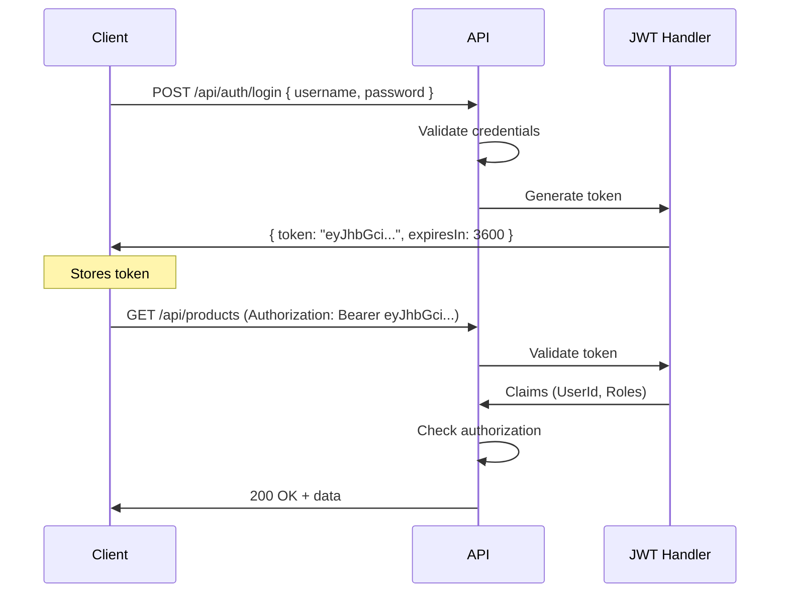

# 07 — Advanced Topics & Deployment

---

## 1. JWT Authentication & Authorization

### 1.1 The Flow



### 1.2 Setup

```bash
dotnet add package Microsoft.AspNetCore.Authentication.JwtBearer
```

```csharp
// Program.cs
builder.Services.AddAuthentication(JwtBearerDefaults.AuthenticationScheme)
    .AddJwtBearer(options => {
        options.TokenValidationParameters = new TokenValidationParameters {
            ValidateIssuer = true,
            ValidateAudience = true,
            ValidateLifetime = true,
            ValidateIssuerSigningKey = true,
            ValidIssuer = builder.Configuration["Jwt:Issuer"],
            ValidAudience = builder.Configuration["Jwt:Audience"],
            IssuerSigningKey = new SymmetricSecurityKey(
                Encoding.UTF8.GetBytes(builder.Configuration["Jwt:Key"]!))
        };
    });

builder.Services.AddAuthorization();

// ...
app.UseAuthentication();
app.UseAuthorization();
```

### 1.3 Login Endpoint

```csharp
[ApiController]
[Route("api/[controller]")]
public class AuthController : ControllerBase {
    private readonly IConfiguration _config;

    public AuthController(IConfiguration config) => _config = config;

    [HttpPost("login")]
    public IActionResult Login([FromBody] LoginDto dto) {
        // Validate against DB — this is just a demo
        if (dto.Username != "admin" || dto.Password != "password")
            return Unauthorized();

        var token = GenerateJwtToken(dto.Username, new[] { "Admin", "User" });
        return Ok(new { Token = token, ExpiresIn = 3600 });
    }

    private string GenerateJwtToken(string username, string[] roles) {
        var key = new SymmetricSecurityKey(
            Encoding.UTF8.GetBytes(_config["Jwt:Key"]!));
        var creds = new SigningCredentials(key, SecurityAlgorithms.HmacSha256);

        var claims = new List<Claim> {
            new(ClaimTypes.Name, username),
            new(ClaimTypes.NameIdentifier, username),
        };
        claims.AddRange(roles.Select(r => new Claim(ClaimTypes.Role, r)));

        var token = new JwtSecurityToken(
            issuer: _config["Jwt:Issuer"],
            audience: _config["Jwt:Audience"],
            claims: claims,
            expires: DateTime.UtcNow.AddHours(1),
            signingCredentials: creds
        );

        return new JwtSecurityTokenHandler().WriteToken(token);
    }
}

public record LoginDto(string Username, string Password);
```

### 1.4 Protecting Endpoints

```csharp
[ApiController]
[Route("api/[controller]")]
public class ProductsController : ControllerBase {

    // Anyone can read
    [HttpGet]
    public async Task<IActionResult> GetAll() { }

    // Only authenticated users
    [HttpPost]
    [Authorize]
    public async Task<IActionResult> Create(CreateProductDto dto) { }

    // Only Admin role
    [HttpDelete("{id:int}")]
    [Authorize(Roles = "Admin")]
    public async Task<IActionResult> Delete(int id) { }

    // Custom policy
    [HttpPut("{id:int}")]
    [Authorize(Policy = "CanEditProducts")]
    public async Task<IActionResult> Update(int id, UpdateProductDto dto) { }
}
```

### 1.5 Getting Current User

```csharp
public class ProductsController : ControllerBase {
    [HttpGet("me")]
    public IActionResult GetCurrentUser() {
        var userId = User.FindFirstValue(ClaimTypes.NameIdentifier);
        var roles = User.FindAll(ClaimTypes.Role).Select(c => c.Value);
        return Ok(new { userId, roles });
    }
}
```

---

## 2. ASP.NET Core Identity (Full Auth System)

```bash
dotnet add package Microsoft.AspNetCore.Identity.EntityFrameworkCore
```

```csharp
// Extend your DbContext
public class AppDbContext : IdentityDbContext<User> {
    public AppDbContext(DbContextOptions<AppDbContext> options) : base(options) { }
}

// Custom user
public class User : IdentityUser {
    public string? FullName { get; set; }
    public DateTime CreatedAt { get; set; } = DateTime.UtcNow;
}

// In Program.cs
builder.Services.AddIdentity<User, IdentityRole>()
    .AddEntityFrameworkStores<AppDbContext>()
    .AddDefaultTokenProviders();

// Now you get: UserManager, SignInManager, RoleManager
public class AuthService {
    private readonly UserManager<User> _userManager;
    private readonly SignInManager<User> _signInManager;

    public AuthService(UserManager<User> userManager, SignInManager<User> signInManager) {
        _userManager = userManager;
        _signInManager = signInManager;
    }

    public async Task<User> RegisterAsync(string email, string password, string? fullName) {
        var user = new User { UserName = email, Email = email, FullName = fullName };
        var result = await _userManager.CreateAsync(user, password);
        if (!result.Succeeded)
            throw new ValidationException(string.Join(", ", result.Errors.Select(e => e.Description)));
        await _userManager.AddToRoleAsync(user, "User");
        return user;
    }

    public async Task<User?> LoginAsync(string email, string password) {
        var user = await _userManager.FindByEmailAsync(email);
        if (user is null || !await _userManager.CheckPasswordAsync(user, password))
            return null;
        return user;
    }
}
```

---

## 3. Caching

### 3.1 In-Memory Cache

```csharp
// Program.cs
builder.Services.AddMemoryCache();

// Usage
public class CachedProductService : IProductService {
    private readonly IProductService _inner;
    private readonly IMemoryCache _cache;
    private static readonly TimeSpan CacheDuration = TimeSpan.FromMinutes(5);

    public CachedProductService(IProductService inner, IMemoryCache cache) {
        _inner = inner;
        _cache = cache;
    }

    public async Task<ProductDto?> GetByIdAsync(int id) {
        var key = $"product-{id}";
        return await _cache.GetOrCreateAsync(key, async entry => {
            entry.AbsoluteExpirationRelativeToNow = CacheDuration;
            return await _inner.GetByIdAsync(id);
        });
    }
}

// Register as decorator
builder.Services.AddScoped<IProductService, ProductService>();
builder.Services.Decorate<IProductService, CachedProductService>();
```

### 3.2 Redis Cache (Distributed)

```bash
dotnet add package Microsoft.Extensions.Caching.StackExchangeRedis
```

```csharp
// Program.cs
builder.Services.AddStackExchangeRedisCache(options => {
    options.Configuration = builder.Configuration.GetConnectionString("Redis");
});

// Usage — same interface IDistributedCache
public class RedisCacheService {
    private readonly IDistributedCache _cache;

    public RedisCacheService(IDistributedCache cache) => _cache = cache;

    public async Task SetAsync<T>(string key, T value, TimeSpan? expiry = null) {
        var json = JsonSerializer.Serialize(value);
        await _cache.SetStringAsync(key, json, new DistributedCacheEntryOptions {
            AbsoluteExpirationRelativeToNow = expiry ?? TimeSpan.FromMinutes(10)
        });
    }

    public async Task<T?> GetAsync<T>(string key) {
        var json = await _cache.GetStringAsync(key);
        return json is null ? default : JsonSerializer.Deserialize<T>(json);
    }
}
```

---

## 4. Background Jobs

```csharp
// Services/ProductCleanupService.cs
public class ProductCleanupService : BackgroundService {
    private readonly IServiceProvider _serviceProvider;
    private readonly ILogger<ProductCleanupService> _logger;

    public ProductCleanupService(IServiceProvider serviceProvider, ILogger<ProductCleanupService> logger) {
        _serviceProvider = serviceProvider;
        _logger = logger;
    }

    protected override async Task ExecuteAsync(CancellationToken stoppingToken) {
        _logger.LogInformation("ProductCleanupService started");

        while (!stoppingToken.IsCancellationRequested) {
            try {
                using var scope = _serviceProvider.CreateScope();
                var db = scope.ServiceProvider.GetRequiredService<AppDbContext>();

                var deleted = await db.Products
                    .Where(p => p.IsDeleted && p.CreatedAt < DateTime.UtcNow.AddDays(-30))
                    .ExecuteDeleteAsync(stoppingToken);

                if (deleted > 0)
                    _logger.LogInformation("Cleaned up {Count} old products", deleted);
            } catch (Exception ex) {
                _logger.LogError(ex, "Cleanup error");
            }

            await Task.Delay(TimeSpan.FromHours(24), stoppingToken);
        }
    }
}

// Program.cs
builder.Services.AddHostedService<ProductCleanupService>();
```

---

## 5. Testing

### 5.1 Unit Testing with xUnit + Moq

```bash
dotnet new xunit -n ProductCatalog.Tests
cd ProductCatalog.Tests
dotnet add package Moq
dotnet add reference ../ProductCatalog/ProductCatalog.csproj
```

```csharp
public class ProductServiceTests {
    private readonly Mock<AppDbContext> _mockContext;
    private readonly Mock<ILogger<ProductService>> _mockLogger;
    private readonly ProductService _service;

    public ProductServiceTests() {
        _mockContext = new Mock<AppDbContext>(new DbContextOptions<AppDbContext>());
        _mockLogger = new Mock<ILogger<ProductService>>();
        _service = new ProductService(_mockContext.Object, _mockLogger.Object);
    }

    [Fact]
    public async Task GetByIdAsync_WhenProductExists_ReturnsDto() {
        // Arrange
        var products = new List<Product> {
            new() { Id = 1, Name = "Test", Price = 10, Category = new Category { Name = "TestCat" } }
        }.AsQueryable();

        var mockSet = new Mock<DbSet<Product>>();
        mockSet.As<IQueryable<Product>>().Setup(m => m.Provider).Returns(products.Provider);
        mockSet.As<IQueryable<Product>>().Setup(m => m.Expression).Returns(products.Expression);
        mockSet.As<IQueryable<Product>>().Setup(m => m.ElementType).Returns(products.ElementType);
        mockSet.As<IQueryable<Product>>().Setup(m => m.GetEnumerator()).Returns(products.GetEnumerator());

        _mockContext.Setup(c => c.Products).Returns(mockSet.Object);

        // Act
        var result = await _service.GetByIdAsync(1);

        // Assert
        Assert.NotNull(result);
        Assert.Equal("Test", result!.Name);
    }

    [Fact]
    public async Task GetByIdAsync_WhenProductMissing_ReturnsNull() {
        var result = await _service.GetByIdAsync(999);
        Assert.Null(result);
    }
}
```

### 5.2 Integration Testing

```csharp
public class ProductApiTests : IClassFixture<WebApplicationFactory<Program>> {
    private readonly HttpClient _client;

    public ProductApiTests(WebApplicationFactory<Program> factory) {
        _client = factory.WithWebHostBuilder(builder => {
            builder.ConfigureTestServices(services => {
                services.RemoveAll<AppDbContext>();
                services.AddDbContext<AppDbContext>(opts =>
                    opts.UseInMemoryDatabase("TestDb"));
            });
        }).CreateClient();
    }

    [Fact]
    public async Task GetProducts_ReturnsSuccess() {
        var response = await _client.GetAsync("/api/products");
        response.EnsureSuccessStatusCode();
        Assert.Equal(HttpStatusCode.OK, response.StatusCode);
    }

    [Fact]
    public async Task GetProductById_WhenNotFound_Returns404() {
        var response = await _client.GetAsync("/api/products/999");
        Assert.Equal(HttpStatusCode.NotFound, response.StatusCode);
    }
}
```

---

## 6. Deployment

### 6.1 Docker

```dockerfile
# Dockerfile
FROM mcr.microsoft.com/dotnet/sdk:8.0 AS build
WORKDIR /src
COPY ProductCatalog.csproj .
RUN dotnet restore
COPY . .
RUN dotnet publish -c Release -o /app

FROM mcr.microsoft.com/dotnet/aspnet:8.0 AS runtime
WORKDIR /app
COPY --from=build /app .
EXPOSE 80
EXPOSE 443
ENTRYPOINT ["dotnet", "ProductCatalog.dll"]
```

```yaml
# docker-compose.yml
services:
  api:
    build: .
    ports:
      - "5000:80"
    environment:
      - ConnectionStrings__DefaultConnection=Server=db;Database=ProductCatalog;User=sa;Password=YourPassword!;TrustServerCertificate=true
    depends_on:
      - db

  db:
    image: mcr.microsoft.com/mssql/server:2022-latest
    environment:
      - ACCEPT_EULA=Y
      - SA_PASSWORD=YourPassword!
    ports:
      - "1433:1433"
    volumes:
      - sql_data:/var/opt/mssql

volumes:
  sql_data:
```

### 6.2 Configuration per Environment

```json
// appsettings.Development.json
{
  "Logging": { "LogLevel": { "Default": "Debug" } },
  "ConnectionStrings": {
    "DefaultConnection": "Server=localhost;Database=ProductCatalog;Trusted_Connection=True;TrustServerCertificate=True"
  }
}

// appsettings.Production.json
{
  "Logging": { "LogLevel": { "Default": "Warning" } },
  "ConnectionStrings": {
    "DefaultConnection": "Server=prod-db;Database=ProductCatalog;User=sa;Password=${DB_PASSWORD};"
  }
}
```

### 6.3 Deploy to Azure

```bash
# Publish
dotnet publish -c Release -o ./publish

# Deploy to Azure App Service
az webapp deploy --resource-group myGroup --name myApi --src-path ./publish.zip
```

### 6.4 IIS Setup

```xml
<!-- web.config (generated by publish) -->
<?xml version="1.0" encoding="utf-8"?>
<configuration>
  <location path="." inheritInChildApplications="false">
    <system.webServer>
      <handlers>
        <add name="aspNetCore" path="*" verb="*"
             modules="AspNetCoreModuleV2" resourceType="Unspecified" />
      </handlers>
      <aspNetCore processPath="dotnet" arguments=".\ProductCatalog.dll"
                  stdoutLogEnabled="false" stdoutLogFile=".\logs\stdout"
                  hostingModel="inprocess">
        <environmentVariables>
          <environmentVariable name="ASPNETCORE_ENVIRONMENT" value="Production" />
        </environmentVariables>
      </aspNetCore>
    </system.webServer>
  </location>
</configuration>
```

---

## 7. Quick Commands Reference

```bash
# Auth
dotnet add package Microsoft.AspNetCore.Authentication.JwtBearer
dotnet add package Microsoft.AspNetCore.Identity.EntityFrameworkCore

# Caching
dotnet add package Microsoft.Extensions.Caching.Memory       # In-memory
dotnet add package Microsoft.Extensions.Caching.StackExchangeRedis  # Redis

# Testing
dotnet new xunit -n Tests
dotnet add package Moq
dotnet add package FluentAssertions

# Background jobs
dotnet add package Hangfire
# or use built-in: IHostedService / BackgroundService

# EF Tools
dotnet tool install --global dotnet-ef
dotnet ef migrations add <Name>
dotnet ef database update
dotnet ef migrations script
```
